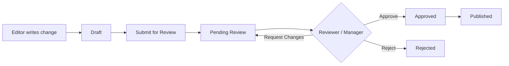

# Setup Guide: Auth & Role System

This guide covers setting up the Supabase + Azure AD authentication and role-based approval system.

## Prerequisites

- A Supabase project (shared with the WMS system or dedicated)
- Azure AD tenant with app registration
- Admin access to both

## 1. Supabase Setup

### Run the Schema

1. Open your Supabase project dashboard
2. Go to **SQL Editor**
3. Paste and execute the contents of `supabase/schema.sql`

This creates:
- `user_profiles` — roles, manager hierarchy, department
- `edit_proposals` — proposed content changes
- `approval_actions` — reviewer decisions
- `approval_rules` — configurable per-section rules
- `audit_log` — all actions tracked

### Configure Environment

Create a `.env.local` file in the project root:

```bash
REACT_APP_SUPABASE_URL=https://your-project.supabase.co
REACT_APP_SUPABASE_ANON_KEY=your-anon-key
```

These values are found in Supabase **Settings > API**.

## 2. Azure AD Configuration

### Register the App in Azure AD

1. Go to **Azure Portal > Azure Active Directory > App registrations**
2. Click **New registration**
3. Set the redirect URI to: `https://your-project.supabase.co/auth/v1/callback`
4. Note the **Application (client) ID** and **Directory (tenant) ID**
5. Under **Certificates & secrets**, create a new client secret

### Configure Supabase Auth

1. Go to Supabase **Authentication > Providers**
2. Enable **Azure**
3. Enter:
   - **Azure Client ID**: from step 4 above
   - **Azure Secret**: from step 5 above
   - **Azure Tenant URL**: `https://login.microsoftonline.com/YOUR_TENANT_ID`

## 3. Role Assignment

### Initial Admin

After the first user signs in via Azure AD, manually set them as admin:

```sql
UPDATE public.user_profiles
SET role = 'admin'
WHERE email = 'your-email@meijer.com';
```

### Manager Hierarchy

Set up reporting relationships in the Admin Panel (`/admin`), or via SQL:

```sql
UPDATE public.user_profiles
SET manager_id = (SELECT id FROM public.user_profiles WHERE email = 'manager@meijer.com')
WHERE email = 'employee@meijer.com';
```

## 4. Role Permissions

| Role | View | Propose Edits | Approve | Manage Users | Manage Rules |
|---|---|---|---|---|---|
| **Viewer** | Yes | No | No | No | No |
| **Editor** | Yes | Yes | No | No | No |
| **Reviewer** | Yes | Yes | Yes | No | No |
| **Admin** | Yes | Yes | Yes | Yes | Yes |
| **Manager** (of editor) | Yes | Per own role | Yes (direct reports only) | No | No |

### Manager Approval

Any user who is set as another user's `manager_id` can approve that person's edit proposals, regardless of their own role. This means a team lead with "editor" role can still approve their team members' edits.

## 5. Approval Workflow



## 6. Approval Rules

Default rules (configurable in Admin Panel):

| Doc Section | Required Role | Manager Can Approve | Min Approvals |
|---|---|---|---|
| `supply-chain/*` | Reviewer | Yes | 1 |
| `systems/*` | Reviewer | Yes | 1 |
| `reference/*` | Reviewer | Yes | 1 |

Rules are enforced automatically — a proposal won't transition to "approved" until it has the required number of approvals from qualified reviewers.

## 7. Schema Migrations

After initial setup, run migrations in order:

```bash
# In Supabase SQL Editor, run:
supabase/migrations/001_improvements.sql
```

This adds:
- `cancelled` proposal status
- Duplicate approval prevention
- Email uniqueness constraint
- Notifications table with real-time subscriptions
- Auto-notification triggers on proposal status changes
- Additional RLS policies for cancel/publish actions

## 8. Email Notifications

### Deploy Edge Function

```bash
supabase functions deploy notify-reviewers
```

### Set Environment Variables

In Supabase dashboard, set these secrets for the edge function:

```bash
supabase secrets set SMTP_HOST=smtp.your-provider.com
supabase secrets set SMTP_PORT=587
supabase secrets set SMTP_USER=your-user
supabase secrets set SMTP_PASS=your-password
supabase secrets set SMTP_FROM=sc-wiki@meijer.com
supabase secrets set SITE_URL=https://sc-wiki.meijer.com
```

### Create Database Webhook

In Supabase Dashboard > Database > Webhooks:
1. Create webhook on `edit_proposals` table for `UPDATE` events
2. Point to: `https://your-project.supabase.co/functions/v1/notify-reviewers`
3. Include the `Authorization` header with your service role key

### What Gets Sent

| Event | Recipients |
|---|---|
| Proposal submitted | All reviewers, admins, author's manager |
| Proposal approved | Author |
| Proposal rejected | Author |

## 9. In-App Notifications

In-app notifications are automatic once the migration is applied. The navbar shows a red badge with the count of pending reviews for reviewers/admins.

Notifications are powered by Supabase real-time subscriptions — they update live without page refresh.
