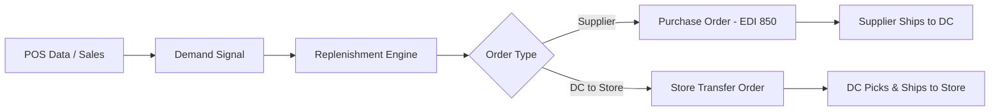

# Replenishment

## Overview

Replenishment is the automated and manual process of reordering products to keep store shelves stocked and DC inventory at optimal levels. Meijer's replenishment system processes point-of-sale data, current inventory positions, and demand forecasts to generate purchase orders for suppliers and transfer orders from DCs to stores.

## Replenishment Flow

## Replenishment Strategies

| Strategy | Description | Used For |
|---|---|---|
| **Min/Max** | Reorder when inventory drops below minimum; order up to maximum level | Staple items with stable demand |
| **Reorder Point (ROP)** | Trigger order when on-hand reaches calculated reorder point | Items with predictable lead times |
| **Forecast-Driven** | Order quantity based on projected future demand from forecast models | Seasonal, promotional, and new items |
| **Top-Off** | Replenish to full shelf capacity on a scheduled basis | High-velocity items, end caps |
| **Manual Override** | Buyer or store manager manually adjusts order quantities | Exceptions, local events, known disruptions |

## Replenishment Parameters

Key parameters configured per item/location:

| Parameter | Description |
|---|---|
| **Safety Stock** | Buffer inventory to protect against demand variability and supply disruptions |
| **Lead Time** | Days from order placement to product availability (supplier lead time + transit) |
| **Order Cycle** | Frequency of order review/placement (daily, every other day, weekly) |
| **Order Minimum** | Minimum order quantity (case pack, pallet, or dollar minimum) |
| **Order Multiple** | Orders rounded up to case pack or pallet quantity |
| **Shelf Capacity** | Maximum facings × depth at the store shelf level |
| **Presentation Stock** | Minimum stock needed for visual presentation on shelf |

## DC-to-Store Replenishment

The store replenishment cycle operates daily for most categories:

1. **POS data collected** — Previous day's sales transmitted from stores overnight
2. **Inventory position calculated** — Current on-hand + on-order - committed demand
3. **Replenishment engine runs** — Calculates need based on projected demand vs. available inventory
4. **Store orders generated** — Transfer orders created for each store by product category
5. **Orders released to DC** — WMS receives orders and includes them in next pick wave
6. **Shipped to store** — Products picked, palletized, and delivered on next available route

### Order Cycle by Category

| Category | Order Frequency | Delivery Frequency |
|---|---|---|
| **Grocery (shelf-stable)** | Daily | 3-5x per week |
| **Fresh produce** | Daily | Daily |
| **Dairy** | Daily | Daily |
| **Frozen** | Daily | 3-5x per week |
| **General merchandise** | 2-3x per week | 2-3x per week |
| **Seasonal** | As needed | As needed |

## Supplier Replenishment (DC Inventory)

DC inventory is replenished through purchase orders to suppliers:

1. **DC demand forecast** — Aggregated store demand + DC safety stock requirements
2. **PO generation** — Auto-generated POs based on replenishment parameters
3. **PO review** — Buyers review and approve or adjust quantities
4. **PO transmission** — Sent to supplier via EDI 850
5. **Supplier acknowledgment** — EDI 855 confirms order
6. **Shipment** — Supplier ships with EDI 856 (ASN)
7. **Receipt** — DC receives and verifies against PO and ASN

## Promotional and Seasonal Replenishment

- **Promotional builds** — Extra inventory ordered ahead of ad breaks and promotional events
- **Promotional lift factors** — Historical data applied to forecast expected sales increase
- **Forward buys** — Opportunistic purchasing when vendor offers temporary cost reductions
- **Seasonal ramp-up/ramp-down** — Inventory levels adjusted as seasons change (e.g., grilling supplies in spring, holiday items in Q4)
- **End-of-season markdowns** — Clearance triggered when seasonal items should be sold through

## Exception Handling

| Exception | Response |
|---|---|
| **Supplier out of stock** | Substitute item or reallocate from alternate supplier |
| **DC stockout** | Expedited PO or cross-DC transfer |
| **Forecast miss (over)** | Reduce future orders; consider markdown if perishable |
| **Forecast miss (under)** | Emergency replenishment order; possible store-to-store transfer |
| **Store capacity exceeded** | Reduce order quantity to shelf capacity; excess held at DC |
| **Lead time change** | Adjust safety stock and reorder point parameters |

## Replenishment Metrics

| Metric | Description | Target |
|---|---|---|
| **In-Stock Rate** | % of SKUs in stock at store level | ≥97% |
| **Fill Rate** | % of store orders shipped complete from DC | ≥98% |
| **Inventory Turns** | Annual sales ÷ average inventory | Category-dependent |
| **Days of Supply** | Current inventory ÷ average daily sales | Category-dependent |
| **Forecast Accuracy** | Mean Absolute Percentage Error (MAPE) | <20% |
| **Excess Inventory** | SKUs with inventory exceeding X weeks of supply | Minimize |
