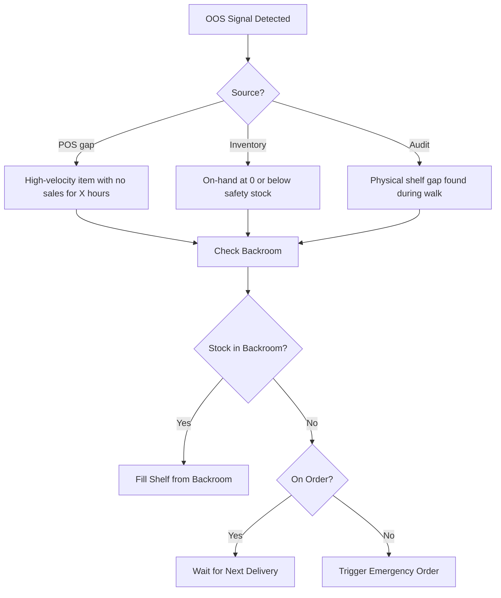

# Store Inventory

## Overview

Store-level inventory management ensures that Meijer's 270+ retail locations have accurate inventory records, properly stocked shelves, and minimal shrinkage. Accurate store inventory is the foundation for effective replenishment, customer satisfaction, and financial reporting.

## Perpetual Inventory Management

Meijer maintains a perpetual inventory system where inventory positions are updated in real-time through system transactions:

| Transaction | Effect on Inventory |
|---|---|
| **POS Sale** | Decreases on-hand by quantity sold |
| **Receiving** | Increases on-hand when DC delivery is received |
| **DSD Receiving** | Increases on-hand when direct-store-delivery is checked in |
| **Returns** | Increases on-hand when customer return is processed |
| **Adjustments** | Manual corrections (positive or negative) by store management |
| **Markdowns / Waste** | Decreases on-hand for damaged, expired, or disposed items |
| **Transfers** | Store-to-store transfers adjust both locations |

## Cycle Counting

Cycle counting is the ongoing process of verifying physical inventory against system records:

### Count Types

| Count Type | Frequency | Scope | Triggered By |
|---|---|---|---|
| **ABC Cycle Counts** | A-items weekly, B-items monthly, C-items quarterly | Subset of SKUs per count | Schedule-based |
| **Negative On-Hand** | Daily | SKUs showing negative system inventory | System alert |
| **Zero On-Hand** | Weekly | SKUs at zero with expected demand | System alert |
| **Category Counts** | Varies | All SKUs in a department or aisle | Planned or audit-driven |
| **Annual Inventory** | Annually | Full store inventory (select departments) | Financial/audit calendar |

### Cycle Count Process
1. **Count list generated** — System produces list of items to count
2. **Physical count** — Associate counts physical inventory at shelf and backroom locations
3. **System comparison** — Counted quantity compared to system on-hand
4. **Variance review** — Discrepancies above threshold require recount or manager approval
5. **Adjustment posted** — Approved variance adjustments update perpetual inventory
6. **Root cause analysis** — Recurring variances investigated (possible theft, scanning issues, receiving errors)

## Shrink Tracking and Prevention

Shrink (inventory loss) is a major cost driver in retail. Sources include:

| Shrink Type | Description | Prevention |
|---|---|---|
| **External Theft** | Customer shoplifting | Loss prevention team, security cameras, high-theft item protection |
| **Internal Theft** | Employee theft | Background checks, access controls, exception reporting |
| **Administrative** | Scanning errors, incorrect receiving, mis-picks | Training, process compliance, system validations |
| **Vendor Fraud** | Short shipments not caught at receiving | ASN reconciliation, weight verification, audits |
| **Waste / Spoilage** | Perishable product expiration or damage | FEFO compliance, temp monitoring, markdown programs |

### Shrink Metrics
- **Shrink %** = (Expected Inventory - Actual Inventory) / Sales × 100
- Tracked at store, department, and category level
- Industry average for grocery/supercenter: 1.5-3% of sales
- Goal: reduce shrink below industry average through targeted programs

## On-Hand Accuracy

Inventory record accuracy (IRA) is critical for replenishment effectiveness:

| Accuracy Level | Impact |
|---|---|
| **>98%** | Replenishment works effectively; minimal out-of-stocks from data errors |
| **95-98%** | Some replenishment gaps; periodic manual correction needed |
| **\<95%** | Frequent out-of-stocks and overstocks; replenishment system unreliable |

### Common Causes of Inaccuracy
- Items scanned incorrectly at POS (wrong UPC, not scanned)
- Receiving errors (wrong quantity accepted)
- Missed markdowns/disposals (product thrown away without system update)
- Backroom inventory not properly tracked
- Theft not reflected in system

## Shelf Management and Planogram Compliance

- **Planograms** — Detailed shelf layouts specifying exact product placement, facings, and shelf position
- **Compliance audits** — Periodic checks that shelf sets match planograms
- **Shelf capacity** — System knows maximum facings × depth per item; replenishment ordered to capacity
- **Out-of-stock (OOS) detection** — Shelf gaps identified through visual audits, inventory analysis, or IoT sensors
- **Shelf replenishment** — Backroom inventory moved to shelf based on picking lists or visual triggers

## Out-of-Stock Detection and Response

### OOS Response Priorities
1. **High-velocity / Key Value Items (KVI)** — Immediate action; trigger expedited replenishment
2. **Promotional items** — Critical during ad period; contact DC for priority shipment
3. **Standard items** — Resolved through normal replenishment cycle
4. **Slow movers** — Monitor; may not require expedited action

## Store Inventory Metrics

| Metric | Description | Target |
|---|---|---|
| **In-Stock Rate** | % of active SKUs with positive on-hand | ≥97% |
| **Inventory Record Accuracy** | % of counted items matching system ±1 unit | ≥98% |
| **Shrink %** | Inventory loss as % of sales | Below industry average |
| **Days of Supply** | Store on-hand ÷ daily sales | Category-specific targets |
| **Backroom Inventory %** | % of store inventory in backroom vs. shelf | Minimize (target \<10%) |
| **Cycle Count Completion** | % of scheduled counts completed on time | 100% |
