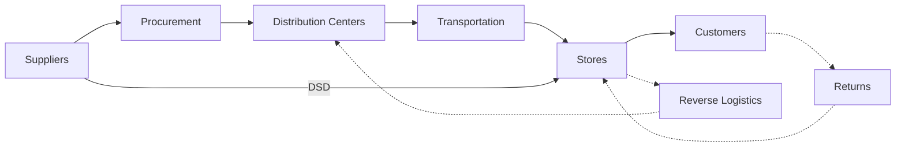

# Supply Chain Overview

Meijer's supply chain moves products from thousands of suppliers to over 270 supercenters and smaller-format Meijer Grocery stores across six Midwestern states. As a privately held, family-owned retailer founded in 1934 by Hendrik Meijer in Greenville, Michigan, Meijer pioneered the supercenter concept and operates one of the largest regional supply chain networks in the United States, with estimated annual revenue exceeding $20 billion.

## Supply Chain Flow

## Network at a Glance

| Metric | Details |
|---|---|
| **Retail Locations** | 270+ supercenters and Meijer Grocery stores |
| **States Served** | Michigan, Ohio, Indiana, Illinois, Kentucky, Wisconsin |
| **Store Formats** | Supercenters (~200,000 sq ft) and Meijer Grocery (~75,000-90,000 sq ft) |
| **Distribution Centers** | Multiple facilities in MI, OH, IN, WI |
| **DC Types** | Grocery, General Merchandise, Frozen/Dairy, Fresh/Perishable, Central Kitchen |
| **Product Categories** | 220,000+ products: Grocery, GM, Fresh, Frozen, Dairy, Pharmacy, Apparel, Home, Garden |
| **Fleet** | ~750 trucks covering 70 million miles/year; 251 tractors, 2,847 trailers |
| **Headquarters** | 2929 Walker Ave NW, Grand Rapids, Michigan |
| **Employees** | ~70,000 team members |
| **Est. Revenue** | $20+ billion annually (private company) |
| **Founded** | 1934 by Hendrik Meijer in Greenville, MI |

## Key Areas

### Procurement
Sourcing products, managing vendor relationships, and purchase order management. Covers both direct-store-delivery (DSD) and warehouse-routed products.

- [Sourcing](/docs/supply-chain/procurement/sourcing)
- [Vendor Management](/docs/supply-chain/procurement/vendor-management)

### Warehouse & DC Operations
The distribution center network that receives, stores, and ships products. Includes ambient, refrigerated, and frozen operations across multiple facility types.

- [DC Operations](/docs/supply-chain/warehouse/dc-operations)
- [Receiving](/docs/supply-chain/warehouse/receiving)
- [Putaway](/docs/supply-chain/warehouse/putaway)
- [Picking & Packing](/docs/supply-chain/warehouse/picking-packing)
- [Shipping](/docs/supply-chain/warehouse/shipping)

### Transportation
Moving products from DCs to stores through a combination of private fleet and third-party carriers.

- [Routing](/docs/supply-chain/transportation/routing)
- [Carrier Management](/docs/supply-chain/transportation/carrier-management)
- [Fleet Operations](/docs/supply-chain/transportation/fleet-operations)
- [Last-Mile Delivery](/docs/supply-chain/transportation/last-mile-delivery)

### Inventory Management
Ensuring the right products are in the right place at the right time across hundreds of stores and millions of SKUs.

- [Replenishment](/docs/supply-chain/inventory/replenishment)
- [Demand Planning](/docs/supply-chain/inventory/demand-planning)
- [Store Inventory](/docs/supply-chain/inventory/store-inventory)

### Returns & Reverse Logistics
Handling product returns, recalls, and reverse supply chain flows.

- [Reverse Logistics](/docs/supply-chain/returns/reverse-logistics)

## Supply Chain Strategy

Meijer's supply chain strategy focuses on several core principles:

1. **Freshness** — Temperature-controlled logistics from farm to shelf for produce, dairy, meat, and bakery products
2. **Availability** — High in-stock rates through automated replenishment and demand forecasting
3. **Efficiency** — Optimized DC operations and transportation routes to minimize cost per case delivered
4. **Sustainability** — Reducing environmental impact through fleet optimization, waste reduction, and energy-efficient facilities
5. **Omnichannel** — Supporting both in-store shopping and digital fulfillment (Meijer Home Delivery, curbside pickup, Shipt partnership)

## Product Flow Types

| Flow Type | Description | Example |
|---|---|---|
| **Warehouse-Routed** | Products flow through DCs before reaching stores | National brand groceries, GM |
| **Direct Store Delivery (DSD)** | Suppliers deliver directly to stores, bypassing DCs | Bread, snacks, beverages |
| **Cross-Dock** | Products move through DC without storage — received and shipped same day | High-velocity items, promotions |
| **Flow-Through** | Pre-allocated product moves through DC with minimal handling | Seasonal merchandise |
| **Drop Ship** | Supplier ships directly to customer for e-commerce orders | Large/bulky items |
