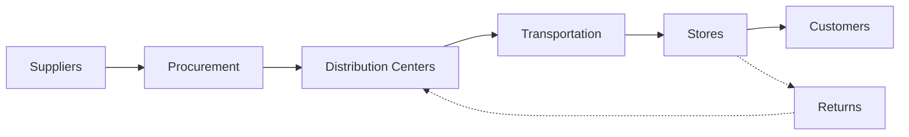

# Supply Chain Overview

Meijer's supply chain moves products from suppliers to over 500 stores across the Midwest. This section documents the end-to-end flow, key processes, and operational knowledge.

## Supply Chain Flow

## Key Areas

### Procurement
Sourcing products, managing vendor relationships, and purchase order management. Covers both direct-store-delivery (DSD) and warehouse-routed products.

- [Sourcing](/docs/supply-chain/procurement/sourcing)
- [Vendor Management](/docs/supply-chain/procurement/vendor-management)

### Warehouse & DC Operations
The distribution center network that receives, stores, and ships products. Includes ambient, refrigerated, and frozen operations.

- [DC Operations](/docs/supply-chain/warehouse/dc-operations)
- [Receiving](/docs/supply-chain/warehouse/receiving)
- [Putaway](/docs/supply-chain/warehouse/putaway)
- [Picking & Packing](/docs/supply-chain/warehouse/picking-packing)
- [Shipping](/docs/supply-chain/warehouse/shipping)

### Transportation
Moving products from DCs to stores and managing carrier relationships.

- [Routing](/docs/supply-chain/transportation/routing)
- [Carrier Management](/docs/supply-chain/transportation/carrier-management)
- [Fleet Operations](/docs/supply-chain/transportation/fleet-operations)
- [Last-Mile Delivery](/docs/supply-chain/transportation/last-mile-delivery)

### Inventory Management
Ensuring the right products are in the right place at the right time.

- [Replenishment](/docs/supply-chain/inventory/replenishment)
- [Demand Planning](/docs/supply-chain/inventory/demand-planning)
- [Store Inventory](/docs/supply-chain/inventory/store-inventory)

### Returns & Reverse Logistics
Handling product returns, recalls, and reverse supply chain flows.

- [Reverse Logistics](/docs/supply-chain/returns/reverse-logistics)

## Network Overview

| Metric | Details |
|---|---|
| Distribution Centers | *Document count and locations* |
| Stores Served | 500+ supercenters and grocery stores |
| States | MI, OH, IN, IL, KY, WI |
| Product Categories | Grocery, GM, Fresh, Frozen, Pharmacy |
