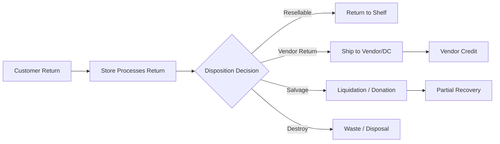

# Reverse Logistics

## Overview

Reverse logistics handles the flow of products back through the supply chain — from customer returns at the store, to vendor returns, product recalls, and disposition decisions. Effective reverse logistics minimizes costs, recovers value where possible, and ensures compliance with food safety and environmental regulations.

## Reverse Logistics Flow

## Customer Return Processing

### Return Policy
Meijer offers a customer-friendly return policy:
- **90 days** for general merchandise with receipt
- **30 days** for electronics (TVs, tablets, cameras)
- **3 days** for live wreaths and Christmas trees
- Perishable items (food, flowers) can be returned if quality is unsatisfactory
- Gas-powered items may incur up to $25 restocking fee
- **Without receipt:** Up to 3 returns in 12 months with valid government-issued ID; refund issued as store credit at lowest selling price in past 30 days
- Receipt lookup via Meijer Rewards / mPerks account for receipt-less returns
- Returns accepted in-store at Customer Service desk or by mail
- Refunds take up to 14 business days; credited to original payment method
- **Non-returnable:** Gift cards, alcohol, tobacco, opened software/electronics, prepaid cards, ammunition, blood glucose monitors

### Store Return Process
1. **Customer presents item** at Customer Service desk
2. **Associate verifies** item condition and receipt/purchase history
3. **System processes refund** — original payment method or store credit
4. **Disposition code assigned** — determines what happens to the returned item
5. **Item routed** — to shelf, vendor return staging, salvage bin, or waste

### Disposition Codes

| Code | Description | Action |
|---|---|---|
| **Restock** | Item in sellable condition, original packaging intact | Return to shelf |
| **Markdown** | Item sellable but damaged packaging or near expiration | Reduced price shelf or clearance |
| **Vendor Return** | Defective item or vendor-authorized return | Stage for vendor pickup or DC return |
| **Salvage** | Not sellable at retail but has residual value | Liquidation partner or donation |
| **Destroy / Waste** | No recoverable value; food safety concern | Disposed per local regulations |
| **Recall** | Item under active recall | Quarantine; follow recall procedures |

## Vendor Return Authorization (VRA)

When defective or unsold products need to go back to the vendor:

1. **VRA request** — Meijer submits return request to vendor (via portal or EDI)
2. **Vendor approves** — Vendor issues return authorization with return shipping instructions
3. **Return shipment** — Items consolidated and shipped to vendor's designated return location
4. **Credit issued** — Vendor issues credit memo (EDI 812 Credit/Debit Adjustment)
5. **Credit applied** — Finance reconciles credit against vendor account

### Common VRA Reasons
- Product defect or quality issue
- Overstock or discontinued item (if return agreement exists)
- Damaged in transit (carrier claim may apply)
- Expired product (if within vendor's acceptance window)
- Recall-related return

## Product Recall Procedures

Product recalls require rapid, coordinated response:

### Recall Classification
| Class | Severity | Action |
|---|---|---|
| **Class I** | Serious health hazard or death | Immediate removal; customer notification |
| **Class II** | Temporary health consequence | Prompt removal; customer notification |
| **Class III** | Not likely to cause health problems | Removal at next opportunity |

### Recall Process
1. **Notification received** — FDA, USDA, CPSC, or manufacturer issues recall
2. **Item identification** — Affected UPCs, lot numbers, and date codes identified
3. **Store notification** — All stores alerted to pull affected product immediately
4. **Product removal** — Items pulled from shelves and backroom; quarantined
5. **Inventory hold** — DC stops shipping affected lots
6. **Customer notification** — Signage posted; loyalty data used to contact affected purchasers
7. **Disposition** — Product returned to vendor, destroyed, or held per recall instructions
8. **Documentation** — Full audit trail maintained for regulatory compliance

## Salvage and Donation Programs

### Liquidation
- Unsellable-at-retail products with residual value are sold to liquidation partners
- Categories include: damaged packaging GM, seasonal overstock, returned electronics
- Sold in bulk lots at significant discount

### Food Waste Reduction
Meijer has a goal to **divert 50% of store food waste from landfills by 2030**, supported by multiple programs:

| Program | Impact |
|---|---|
| **Flashfood Partnership** | 10+ million pounds of food diverted from landfills; 3.7 million pounds in 2024 alone |
| **Feeding America** | 10+ million pounds of surplus food donated to food bank network |
| **Compost & Animal Feed** | 16 million pounds of potential food waste diverted through compost and animal feed programs |
| **Organic Waste Collection** | All stores have organic waste bins; weekly pickup by third-party vendor |

### Recycling and Circular Economy
- **~10 million pounds of plastic film** collected for recycling in 2024
- **257 million pounds of cardboard** recycled across operations
- Partnered with **Dow Chemical** to add recycled plastic bags to asphalt in parking lots
- Recycled pharmacy HDPE bottles into cabinetry counterweights (since 2019)
- Baby gear recycling events at all supercenters (26,000 pounds collected)
- Electronic waste (e-waste) handled through certified recycling partners
- Pharmacy waste disposed per DEA and state pharmacy board regulations
- Company-wide recycling and energy programs in place since 1973

### Sustainability Recognition
- **EPA SmartWay Excellence Award** — 8 total awards since 2017 (both mixed carrier fleet and shipper categories)
- **2023 Sustainable Business of the Year** — Michigan Sustainable Business Forum
- **2022 Circular Economy Leadership Award**
- Achieved **57% reduction in Scope 1 and 2 GHG emissions** vs. 2018 baseline (surpassing 50% target a year early)

## Reverse Logistics Costs and Metrics

| Metric | Description |
|---|---|
| **Return Rate** | % of sold items returned by customers |
| **Recovery Rate** | % of returned value recovered (resale, vendor credit, salvage) |
| **Disposal Cost** | Cost of destroying unsalvageable product |
| **Vendor Credit Recovery** | $ value of credits received from vendor returns |
| **Donation Volume** | Pounds or units of product donated to food banks |
| **Recall Response Time** | Time from recall notification to product removal from shelves |
| **Reverse Logistics Cost % of Sales** | Total reverse logistics cost as % of net sales |
