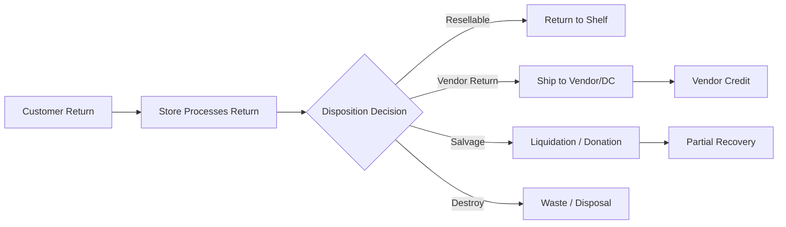

# Reverse Logistics

## Overview

Reverse logistics handles the flow of products back through the supply chain — from customer returns at the store, to vendor returns, product recalls, and disposition decisions. Effective reverse logistics minimizes costs, recovers value where possible, and ensures compliance with food safety and environmental regulations.

## Reverse Logistics Flow

## Customer Return Processing

### Return Policy
Meijer offers a customer-friendly return policy:
- Most items can be returned within 90 days with receipt
- Electronics and select categories have a 30-day return window
- Perishable items (food, flowers) can be returned if quality is unsatisfactory
- Receipt lookup via Meijer Rewards / mPerks account for receipt-less returns

### Store Return Process
1. **Customer presents item** at Customer Service desk
2. **Associate verifies** item condition and receipt/purchase history
3. **System processes refund** — original payment method or store credit
4. **Disposition code assigned** — determines what happens to the returned item
5. **Item routed** — to shelf, vendor return staging, salvage bin, or waste

### Disposition Codes

| Code | Description | Action |
|---|---|---|
| **Restock** | Item in sellable condition, original packaging intact | Return to shelf |
| **Markdown** | Item sellable but damaged packaging or near expiration | Reduced price shelf or clearance |
| **Vendor Return** | Defective item or vendor-authorized return | Stage for vendor pickup or DC return |
| **Salvage** | Not sellable at retail but has residual value | Liquidation partner or donation |
| **Destroy / Waste** | No recoverable value; food safety concern | Disposed per local regulations |
| **Recall** | Item under active recall | Quarantine; follow recall procedures |

## Vendor Return Authorization (VRA)

When defective or unsold products need to go back to the vendor:

1. **VRA request** — Meijer submits return request to vendor (via portal or EDI)
2. **Vendor approves** — Vendor issues return authorization with return shipping instructions
3. **Return shipment** — Items consolidated and shipped to vendor's designated return location
4. **Credit issued** — Vendor issues credit memo (EDI 812 Credit/Debit Adjustment)
5. **Credit applied** — Finance reconciles credit against vendor account

### Common VRA Reasons
- Product defect or quality issue
- Overstock or discontinued item (if return agreement exists)
- Damaged in transit (carrier claim may apply)
- Expired product (if within vendor's acceptance window)
- Recall-related return

## Product Recall Procedures

Product recalls require rapid, coordinated response:

### Recall Classification
| Class | Severity | Action |
|---|---|---|
| **Class I** | Serious health hazard or death | Immediate removal; customer notification |
| **Class II** | Temporary health consequence | Prompt removal; customer notification |
| **Class III** | Not likely to cause health problems | Removal at next opportunity |

### Recall Process
1. **Notification received** — FDA, USDA, CPSC, or manufacturer issues recall
2. **Item identification** — Affected UPCs, lot numbers, and date codes identified
3. **Store notification** — All stores alerted to pull affected product immediately
4. **Product removal** — Items pulled from shelves and backroom; quarantined
5. **Inventory hold** — DC stops shipping affected lots
6. **Customer notification** — Signage posted; loyalty data used to contact affected purchasers
7. **Disposition** — Product returned to vendor, destroyed, or held per recall instructions
8. **Documentation** — Full audit trail maintained for regulatory compliance

## Salvage and Donation Programs

### Liquidation
- Unsellable-at-retail products with residual value are sold to liquidation partners
- Categories include: damaged packaging GM, seasonal overstock, returned electronics
- Sold in bulk lots at significant discount

### Food Donation
- Meijer donates edible food that cannot be sold to food banks and community organizations
- Partnerships with organizations like Feeding America network member food banks
- Fresh produce, bakery, dairy, and shelf-stable items redirected from waste stream
- Compliant with the Good Samaritan Food Donation Act (liability protection)

### Recycling and Waste Reduction
- Cardboard and plastic packaging baled and recycled at store and DC level
- Organic waste composting programs at select locations
- Electronic waste (e-waste) handled through certified recycling partners
- Pharmacy waste disposed per DEA and state pharmacy board regulations

## Reverse Logistics Costs and Metrics

| Metric | Description |
|---|---|
| **Return Rate** | % of sold items returned by customers |
| **Recovery Rate** | % of returned value recovered (resale, vendor credit, salvage) |
| **Disposal Cost** | Cost of destroying unsalvageable product |
| **Vendor Credit Recovery** | $ value of credits received from vendor returns |
| **Donation Volume** | Pounds or units of product donated to food banks |
| **Recall Response Time** | Time from recall notification to product removal from shelves |
| **Reverse Logistics Cost % of Sales** | Total reverse logistics cost as % of net sales |
