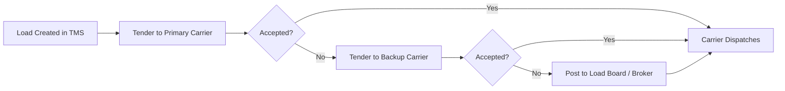

# Carrier Management

## Overview

Meijer uses a mix of its private fleet and third-party carriers to transport products from distribution centers to stores. Carrier management covers the selection, contracting, performance monitoring, and day-to-day coordination of these transportation partners.

## Carrier Mix

| Carrier Type | Description | Typical Usage |
|---|---|---|
| **Private Fleet** | Meijer-owned trucks and employed drivers | Primary DC-to-store deliveries; highest control |
| **Dedicated Contract Carriers** | Third-party carriers committed to Meijer with dedicated equipment | Overflow and specific lanes |
| **Common Carriers** | Shared-capacity carriers available on the spot market or contract | Seasonal peaks, long-haul, specialty freight |
| **Intermodal** | Rail + truck combination for long-distance moves | Inbound supplier freight from distant regions |

## Carrier Selection and Contracting

### Selection Criteria
- Safety record (CSA scores, accident history)
- Service area alignment with Meijer's network
- Equipment availability and type (dry, reefer, multi-temp)
- Pricing competitiveness
- Technology capabilities (EDI, GPS tracking, ELD)
- Insurance coverage and compliance

### Contract Components
- **Lane-based rates** — Fixed rates for specific origin-destination pairs
- **Fuel surcharge** — Indexed to DOE national average diesel price
- **Accessorial charges** — Detention, layover, stop-off, and driver-assist fees
- **Volume commitments** — Minimum tender percentage guarantees
- **Service level agreements** — On-time pickup/delivery, claims handling, communication

## Load Tendering Process

- Loads tendered via EDI 204 (Motor Carrier Load Tender)
- Carrier responds with EDI 990 (Response to Load Tender) — accept or reject
- Tender waterfall: primary carrier → backup carrier → spot market
- Auto-tendering enabled for routine lanes; manual tendering for exceptions

## Rate Management and Freight Audit

- **Rate tables** — Maintained in TMS by lane, carrier, and equipment type
- **Fuel surcharge updates** — Recalculated weekly based on DOE index
- **Freight audit** — All carrier invoices audited against contracted rates
- **Discrepancy resolution** — Rate mismatches flagged and resolved before payment
- **Payment terms** — Typically net 30 days from approved invoice

## Carrier Performance Scorecards

| KPI | Description | Target |
|---|---|---|
| **On-Time Pickup** | % of loads picked up within scheduled window | ≥95% |
| **On-Time Delivery** | % of loads delivered within store window | ≥95% |
| **Tender Acceptance Rate** | % of tendered loads accepted by carrier | ≥90% |
| **Claims Ratio** | Freight claims as % of total shipments | <0.5% |
| **OS&D Rate** | Over, short, and damaged incidents per 100 loads | <1.0 |
| **EDI Compliance** | % of required EDI transactions sent on time | ≥99% |
| **Safety Score** | CSA score and incident history | Satisfactory |

Scorecards are reviewed quarterly with carriers. Top performers receive increased volume; underperformers receive corrective action plans or contract termination.

## Claims Management

| Claim Type | Process |
|---|---|
| **Freight damage** | Filed within 9 months per Carmack Amendment; photos and documentation required |
| **Shortage** | Noted on delivery receipt (POD); claim filed with supporting documentation |
| **Temperature excursion** | Reefer temperature logs reviewed; claim filed if carrier fault |
| **Late delivery** | Documented but typically not financially claimed unless specific SLA exists |

## Carrier Communication

- **EDI 204** — Load tender (outbound to carrier)
- **EDI 990** — Tender response (carrier accepts/rejects)
- **EDI 214** — Shipment status updates (carrier to Meijer)
- **EDI 210** — Freight invoice (carrier billing)
- **GPS/Telematics** — Real-time tracking for visibility
- **Carrier portal** — Self-service access to load details, documents, and payments
