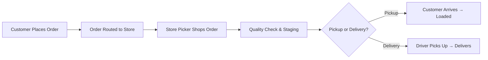

# Last-Mile Delivery

## Overview

Last-mile delivery at Meijer covers two distinct operations: the traditional DC-to-store delivery that gets products onto shelves, and the growing e-commerce fulfillment operations that deliver directly to customers' homes through Meijer Home Delivery and curbside pickup (Meijer Pickup).

## DC-to-Store Delivery

### Store Receiving
- Stores receive deliveries at dedicated dock areas or through back-of-store receiving doors
- Delivery timing coordinated to minimize disruption to customer shopping
- Drivers perform live unloads or drop trailers depending on store configuration
- Store team verifies delivery against manifest and signs proof of delivery

### Delivery Confirmation
- **Electronic POD** — Driver captures delivery confirmation via mobile device
- **Exception reporting** — Shortages, damages, or wrong items noted on delivery receipt
- **Temperature logging** — Reefer trailer temp verified and logged at delivery
- **Store signature** — Authorized store team member signs for the load

## E-Commerce Fulfillment

Meijer offers several digital fulfillment options to customers:

### Meijer Pickup (Curbside)
- Customers order through the Meijer app or meijer.com
- Orders picked by store team members from store shelves
- Customer drives to designated pickup area; order loaded into vehicle
- Available at most Meijer locations

### Meijer Home Delivery
- Customers order through the Meijer app or meijer.com for delivery to their home
- **Membership:** $99/year or $14/month; free unlimited delivery for orders over $35
- Orders fulfilled from the nearest Meijer store
- Customers can shop from ~80,000 items online
- Same-day and scheduled delivery windows available
- Beer and wine delivery available in Ohio and Michigan

### Delivery Partners

| Partner | Service | Coverage |
|---|---|---|
| **Shipt** (Target subsidiary) | Primary same-day delivery partner since 2016; shoppers pick and deliver from Meijer stores | All six states |
| **Instacart** | Same-day delivery from nearly all Meijer stores | All six states |
| **DoorDash** | Grocery and alcohol delivery | Select states (IL, KY, MI, OH) |

### Micro-Fulfillment
Meijer has piloted **Dematic micro-fulfillment centers (MFCs)** inside select supercenters to improve e-commerce pick speed and accuracy. The first MFC, near Grand Rapids, MI, fits into ~10,000 sq ft of existing store space and was constructed in approximately 12 weeks.

## Fulfillment Process (E-Commerce)

### Store Picking for E-Commerce
- Pickers use handheld devices to shop the order from store shelves
- Substitution rules applied when items are out of stock (customer-approved alternatives)
- Temperature-sensitive items (frozen, refrigerated) kept in holding coolers/freezers until pickup or dispatch
- Orders staged in designated area by order number

## Temperature-Controlled Last Mile

| Product Type | Requirement |
|---|---|
| **Frozen** | Insulated bags with ice packs for home delivery; frozen staging for pickup |
| **Refrigerated** | Insulated totes maintained at ≤40°F until customer handoff |
| **Fresh produce/meat** | Separated from chemicals/cleaning products; kept cool |
| **Ambient grocery** | Standard handling; no special temperature requirements |

## Customer Communication

- **Order confirmation** — Email/app notification when order is placed
- **Picking updates** — Notification when shopping begins; substitution approvals
- **Ready for pickup** — Alert when curbside order is staged and ready
- **Delivery tracking** — Real-time driver location and ETA for home delivery
- **Delivery confirmation** — Photo proof of delivery and completion notification

## Last-Mile Metrics

| Metric | Description |
|---|---|
| **On-Time Delivery Rate** | % of home deliveries arriving within promised window |
| **Pickup Wait Time** | Average time from customer arrival to order loaded |
| **Order Accuracy** | % of orders delivered with all correct items |
| **Substitution Rate** | % of items substituted due to out-of-stock |
| **Customer Satisfaction (CSAT)** | Post-delivery customer rating |
| **Cost Per Order** | Total fulfillment + delivery cost divided by orders |
