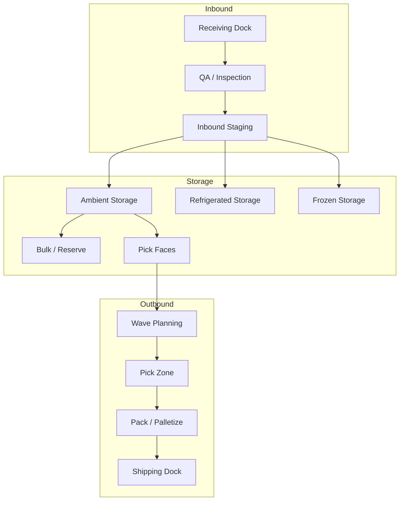

# Distribution Center Operations

## Overview

Meijer operates a network of distribution centers across the Midwest that serve as the hub of its supply chain. These facilities receive products from suppliers, store inventory, and ship orders to 270+ retail locations across Michigan, Ohio, Indiana, Illinois, Kentucky, and Wisconsin.

## DC Network

Meijer's distribution network includes multiple facility types strategically located to minimize transportation costs and delivery times:

| Facility Type | Function | Temperature |
|---|---|---|
| **Grocery DC** | Shelf-stable food, beverages, household items | Ambient |
| **General Merchandise DC** | Non-food items: apparel, home, electronics, seasonal | Ambient |
| **Frozen/Dairy DC** | Frozen foods and dairy products | Frozen (-10°F to 0°F) / Refrigerated (34°F-38°F) |
| **Fresh/Perishable DC** | Produce, meat, deli, bakery | Refrigerated (34°F-38°F) |
| **Central Kitchen** | Prepared food production | Mixed |
| **E-commerce Fulfillment** | Online order fulfillment for home delivery | Mixed temperature zones |

### Key Locations

#### Lansing, Michigan (Major Distribution Complex)
The Lansing campus is Meijer's largest distribution hub, spanning over 2.7 million square feet with 2,500+ team members. Established in 1974, it now features WITRON automated warehousing technology.

| Facility | Address |
|---|---|
| **DC #85** | 5820 Millet Highway, Lansing, MI 48917 |
| **DC #86** | 3301 S. Creyts Road, Lansing, MI 48917 |
| **DC #89** | 3303 S. Creyts Road, Lansing, MI 48917 |
| **DC #92** | 6001 Millet Highway, Lansing, MI 48917 |

#### Grand Rapids, Michigan
| Facility | Address |
|---|---|
| **DC #90** | 2725 Walker Ave. NW, Grand Rapids, MI 49544 |

#### Newport, Michigan
| Facility | Address |
|---|---|
| **DC #881, #882, #883** | 8857 Swan Creek Road, Newport, MI 48166 |

#### Tipp City, Ohio
| Facility | Address |
|---|---|
| **DC #801** | 4200 S. County Road 25A, Tipp City, OH 45371 |
| **RSC #802** | 4220 S. County Road 25A, Tipp City, OH 45371 |
| **DC #803** | 4230 S. County Road 25A, Tipp City, OH 45371 |
| **DF #805** | 4250 S. County Road 25A, Tipp City, OH 45371 |

#### Pleasant Prairie, Wisconsin (WITRON Automated Facility)
A $146 million, 770,000 sq ft facility fully automated with WITRON OPM technology. Features 9 COM systems, 9 crane aisles, 23,216 pallet spaces, and 22.4-meter storage height across 10 levels. Supplies 46 stores with ~13,500 dry goods articles across Wisconsin and Greater Chicagoland.

| Facility | Address |
|---|---|
| **DC (Automated)** | 8900 Green Bay Rd, Pleasant Prairie, WI 53158 |

#### Middlebury, Indiana
| Facility | Address |
|---|---|
| **DC #860 (Central Kitchen)** | Middlebury, IN 46540 |

### Automation Partners

| Partner | Technology | Scope |
|---|---|---|
| **WITRON** | OPM (Order Picking Machinery) — fully automated dry grocery distribution | Pleasant Prairie, WI; Lansing, MI |
| **Dematic** | Micro-fulfillment centers (MFC) for in-store e-commerce fulfillment | Pilot at Grand Rapids-area supercenter (~10,000 sq ft, built in ~12 weeks) |

## Facility Layout

A typical Meijer DC includes the following zones:

### Zone Definitions

| Zone | Description |
|---|---|
| **Receiving** | Dock doors for inbound trailers, staging for inspection and putaway |
| **Reserve Storage** | High-density pallet racking for bulk inventory |
| **Pick Faces** | Forward pick locations for case and each picking |
| **Cross-Dock** | Flow-through area for products that bypass storage |
| **Value-Added Services** | Re-pack, labeling, kitting, and display building |
| **Shipping** | Outbound dock doors, staging lanes, and load-out area |

## Shift Structure

DCs typically operate on a multi-shift schedule to maximize throughput:

| Shift | Hours | Primary Functions |
|---|---|---|
| **Day Shift** | 6:00 AM - 2:30 PM | Receiving, putaway, value-added services |
| **Afternoon Shift** | 2:00 PM - 10:30 PM | Picking, packing, shipping |
| **Night Shift** | 10:00 PM - 6:30 AM | Shipping completion, cycle counting, replenishment |
| **Weekend** | Varies | Reduced operations, catch-up, maintenance |

## Equipment and Material Handling

| Equipment | Use |
|---|---|
| **Sit-down Forklifts** | Unloading trailers, bulk putaway |
| **Reach Trucks** | High-bay racking putaway and replenishment |
| **Order Pickers** | Case picking from mid-height locations |
| **Pallet Jacks (electric)** | Pallet movement in staging and shipping |
| **Conveyor Systems** | Case transport between zones |
| **RF Scanners** | Barcode scanning for all WMS transactions |
| **Voice Picking Headsets** | Hands-free picking direction in pick zones |

## Throughput Metrics

| Metric | Description |
|---|---|
| **Cases Per Hour (CPH)** | Picking productivity per associate |
| **Dock-to-Stock Time** | Time from trailer arrival to inventory availability |
| **Order Fill Rate** | % of store orders shipped complete |
| **Trailer Utilization** | % of outbound trailer capacity used |
| **Inventory Accuracy** | % match between system and physical counts |
| **On-Time Shipment** | % of loads departing within planned window |

## Safety and Compliance

- **OSHA Compliance** — All facilities follow OSHA workplace safety standards
- **Food Safety** — FDA and state health department requirements for food handling
- **Temperature Monitoring** — Continuous temperature logging in refrigerated and frozen zones
- **Hazmat Handling** — Proper storage and handling procedures for hazardous materials (cleaning products, automotive)
- **PPE Requirements** — Steel-toe boots, high-visibility vests, cold-weather gear in frozen zones
- **Powered Industrial Truck (PIT) Certification** — All forklift operators must be certified
