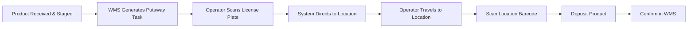

# Putaway

## Overview

Putaway is the process of moving received goods from the inbound staging area to their designated storage locations in the warehouse. Effective putaway ensures products are stored in the correct location, at the right temperature, and in a way that optimizes future picking efficiency.

## Putaway Process Flow

## Putaway Strategies

The WMS uses configurable rules to determine optimal putaway locations:

| Strategy | Description | Use Case |
|---|---|---|
| **Directed Putaway** | WMS assigns specific location based on item attributes and slot profile | Default for all products |
| **Zone-Based** | Product directed to a specific zone (ambient, refrigerated, frozen) first, then to a slot | Temperature-controlled items |
| **Closest Available** | System finds nearest open slot matching product attributes | High-volume periods, overflow |
| **Fixed Location** | Item always goes to the same designated slot | Fast-movers with dedicated pick faces |
| **Random** | Product placed in any available slot within the appropriate zone | Reserve/overflow storage |

## Slotting Optimization

Slotting determines where products should live in the warehouse to maximize picking efficiency:

- **Velocity-based slotting** — Fast-moving items (A-movers) placed in ergonomic, easy-access pick face locations
- **Size/weight considerations** — Heavy items at waist height, lighter items higher or lower
- **Product family grouping** — Related items slotted near each other to support order consolidation
- **Seasonal re-slots** — Seasonal products moved to prime locations during peak periods
- **Ergonomic optimization** — Minimize bending, reaching, and travel distance for highest-frequency picks

Slotting reviews are performed periodically based on velocity changes, new item introductions, and seasonal shifts.

## Storage Location Types

| Location Type | Description | Used For |
|---|---|---|
| **Reserve Rack** | High-bay pallet racking (3-5 levels) | Bulk storage, overstock |
| **Pick Face** | Ground-level or mezzanine case-pick slots | Active picking locations |
| **Floor Stack** | Open floor area for palletized storage | High-cube items, promotions |
| **Drive-In Rack** | Deep-lane racking for high-density storage | Single-SKU, high-volume items |
| **Flow Rack** | Gravity-fed roller rack for FIFO case picking | Medium-velocity items |
| **Refrigerated/Frozen** | Temperature-controlled versions of above | Perishable and frozen products |

## FIFO / FEFO Enforcement

- **FIFO (First In, First Out)** — Standard for non-perishable products; ensures oldest inventory ships first
- **FEFO (First Expired, First Out)** — Required for perishable products; system tracks expiration dates and prioritizes nearest expiration for picking
- WMS enforces FIFO/FEFO through directed picking logic — operators are guided to the correct pallet/case
- Putaway assigns locations to maintain date sequence within a slot

## Putaway Task Prioritization

Tasks are prioritized by the WMS based on:

1. **Temperature-sensitive product** — Frozen and refrigerated items get highest priority to maintain cold chain
2. **Cross-dock items** — Products tagged for immediate shipment bypass storage
3. **Pick face replenishment** — Low-stock pick faces trigger urgent putaway to prevent pick interruptions
4. **Reserve putaway** — Standard bulk putaway to reserve locations
5. **Staging overflow** — Clearing inbound staging areas during high-volume receiving periods

## Exception Handling

| Exception | Resolution |
|---|---|
| **Location full** | WMS redirects to alternate location; operator confirms |
| **Wrong product at location** | Operator reports mismatch; supervisor investigates and resolves |
| **Damaged product found** | Route to damage hold area; update inventory status |
| **System/scanner failure** | Operator records manual putaway; keyed into WMS when system restored |
| **Location does not exist** | Report to warehouse admin for master data correction |
