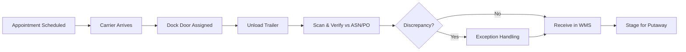

# Receiving

## Overview

Receiving is the first step in the distribution center workflow. It involves scheduling inbound deliveries, unloading trailers, verifying shipments against purchase orders and ASNs, inspecting product quality, and making inventory available in the WMS for putaway.

## Receiving Process Flow

## Appointment Scheduling

- Inbound deliveries require a scheduled appointment at the receiving DC
- Appointments are managed through the vendor portal or EDI-based scheduling
- Each DC has defined receiving hours and dock door capacity
- Appointments specify: carrier, PO number(s), expected pallet/case count, product type (ambient/refrigerated/frozen)
- Carriers arriving without an appointment may be turned away or directed to a holding area

## Dock Door Assignment

When a carrier checks in, the yard management process assigns a dock door based on:
- **Product type** — Frozen/refrigerated product goes to temperature-controlled doors
- **Destination zone** — Products heading to specific storage areas are directed to nearby doors
- **Cross-dock priority** — Products flagged for cross-dock or immediate shipping get priority doors
- **Door availability** — Real-time door utilization and queue management

## Unloading Procedures

| Product Type | Procedure |
|---|---|
| **Ambient pallets** | Forklift unload to inbound staging |
| **Refrigerated** | Unload within 30 minutes to maintain cold chain; verify trailer temp ≤40°F |
| **Frozen** | Unload within 20 minutes; verify trailer temp ≤0°F |
| **Floor-loaded cases** | Manual or conveyor unload to inbound staging; palletize as needed |
| **Mixed loads** | Separate by temperature zone during unload |

## ASN Reconciliation

The Advance Ship Notice (EDI 856) is the primary tool for verifying inbound shipments:

1. **ASN received** — Supplier transmits ASN before shipment arrival with item, quantity, pallet, and carton-level detail
2. **License plate scan** — Receiver scans SSCC (Serial Shipping Container Code) barcode on each pallet
3. **System match** — WMS matches scanned pallet to expected ASN data
4. **Quantity verification** — Case counts verified against ASN; random weight items verified by weight
5. **Discrepancy resolution** — Overages, shortages, or wrong items flagged for exception processing

### When ASN Is Missing
If no ASN is available (non-compliant vendor or system issue):
- Receiver performs a blind receive — manually keying PO number, item, and quantity
- Process is significantly slower and error-prone
- Missing ASN is flagged as a vendor compliance issue

## Quality Inspection

### Standard Inspection
- Visual check for case damage, pallet integrity, and temperature compliance
- Label verification: correct UPC, lot numbers, expiration dates
- Random case opening for spot-check of product condition

### Enhanced Inspection (Triggered by)
- New vendor's first shipments
- Vendor with recent quality issues
- Product under active recall
- Customer complaints traced to specific lots

### Temperature Checks
- Refrigerated products: must arrive at ≤40°F
- Frozen products: must arrive at ≤0°F
- Temperature recorded using infrared thermometer and/or data logger
- Out-of-temp product is quarantined for quality decision (accept, reject, or reduce shelf life)

## Exception Handling

| Exception | Process |
|---|---|
| **Shortage** | Receive actual quantity; create shortage claim against PO |
| **Overage** | Receive expected quantity; refuse or return excess; notify vendor |
| **Wrong Item** | Reject item; receive correct items only; notify vendor |
| **Damaged Product** | Quarantine damaged cases; receive undamaged; initiate damage claim |
| **Wrong Temperature** | Quarantine product; quality team evaluates disposition |
| **Missing Labels** | Quarantine or relabel if feasible; vendor chargeback |

## Receiving Metrics

| Metric | Description | Target |
|---|---|---|
| **Dock-to-Stock Time** | Time from trailer check-in to inventory availability | <4 hours (ambient), <2 hours (perishable) |
| **Receiving Accuracy** | % of receipts with zero discrepancies | ≥99% |
| **Unload Time** | Average time to fully unload a trailer | <45 minutes |
| **ASN Match Rate** | % of receipts with valid, accurate ASN | ≥98% |
| **Temperature Compliance** | % of temp-sensitive loads arriving within spec | ≥99% |
