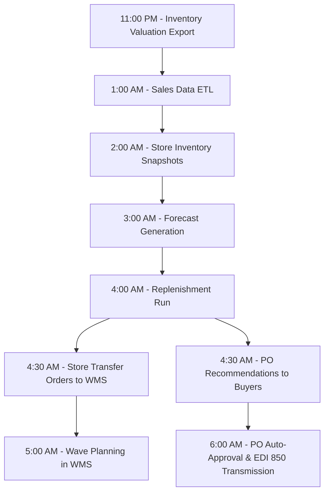

# Data Flows

## Overview

This document describes the key data flows between Meijer's supply chain systems — what data moves, when, and how. Understanding these flows is essential for troubleshooting integration issues and planning system changes.

## End-to-End Data Flow

```mermaid
graph TB
    subgraph Store
        POS[POS System]
        SIM[Store Inventory]
    end

    subgraph Planning
        FC[Forecast Engine]
        RP[Replenishment Engine]
        OMS[Ordering System]
    end

    subgraph DC Operations
        WMS[WMS]
    end

    subgraph Transportation
        TMS[TMS]
    end

    subgraph External
        SUP[Suppliers]
        CAR[Carriers]
    end

    subgraph Integration Layer
        EDI[EDI Gateway]
        API[API Gateway]
        BATCH[Batch Processing]
    end

    POS -->|Sales data - near real-time| API --> FC
    SIM -->|Inventory snapshots - daily| BATCH --> RP
    FC -->|Forecasts - daily| RP
    RP -->|Store orders - daily| API --> WMS
    RP -->|PO recommendations - daily| OMS
    OMS -->|EDI 850 - as generated| EDI --> SUP
    SUP -->|EDI 855 - as received| EDI --> OMS
    SUP -->|EDI 856 - before shipment| EDI --> WMS
    WMS -->|Receipt confirmation - real-time| API --> RP
    WMS -->|Ship confirmation - real-time| API --> TMS
    TMS -->|Load tender EDI 204 - as planned| EDI --> CAR
    CAR -->|EDI 214 status - in transit| EDI --> TMS
    CAR -->|EDI 210 invoice - post delivery| EDI --> BATCH
    WMS -->|Inventory positions - real-time| API --> SIM
```

## Real-Time Data Flows

| Flow | Source | Destination | Trigger | Method | Latency |
|---|---|---|---|---|---|
| POS sales | Store POS | Inventory systems | Each transaction | API event | <5 min |
| Receipt confirmation | WMS | Inventory systems | Receipt closed | API webhook | <1 min |
| Ship confirmation | WMS | TMS | Load dispatched | API | <1 min |
| Inventory update | WMS | Store inventory | Inventory change | API | <5 min |
| Shipment tracking | TMS/GPS | Store operations | Position update | API | <15 min |
| Order status | OMS | Buyer dashboard | Status change | API event | <1 min |

## Batch Data Flows

| Flow | Source | Destination | Schedule | Method | Volume |
|---|---|---|---|---|---|
| Store inventory snapshots | Store systems | Replenishment engine | Daily 2:00 AM | SFTP batch file | ~500 stores × all SKUs |
| Demand forecast generation | Forecast engine | Replenishment engine | Daily 3:00 AM | Database batch | All active items |
| Replenishment run | Replenishment engine | WMS + OMS | Daily 4:00 AM | API + batch | Store orders + PO recommendations |
| Vendor cost file load | Vendor portal | Item master | Weekly / as changed | SFTP | Updated cost records |
| Inventory valuation | WMS + stores | Finance/ERP | Daily 11:00 PM | Batch file | Full inventory positions |
| Sales reporting | POS data warehouse | BI/Analytics | Daily 1:00 AM | ETL batch | Previous day's transactions |
| Freight invoice processing | EDI gateway | Finance/AP | Daily 6:00 AM | Batch | Previous day's carrier invoices |
| Performance metrics | All systems | BI dashboard | Hourly | API/batch | KPI calculations |

## Nightly Batch Processing Sequence

The nightly batch cycle runs in a specific sequence — each step depends on the prior step completing:



### Critical Path
The 2:00 AM → 5:00 AM sequence is the critical path. If store inventory snapshots are delayed, the entire replenishment and wave planning cycle is pushed back, potentially delaying store deliveries.

## EDI Data Flows

| Transaction | Direction | Trigger | Volume |
|---|---|---|---|
| **850 - Purchase Order** | Meijer → Supplier | PO created/approved | Hundreds per day |
| **855 - PO Acknowledgment** | Supplier → Meijer | PO received by vendor | Per PO received |
| **856 - ASN** | Supplier → Meijer | Shipment dispatched | Per shipment |
| **810 - Invoice** | Supplier → Meijer | Goods delivered | Per shipment/PO |
| **812 - Credit/Debit** | Both directions | Adjustment needed | As needed |
| **846 - Inventory Inquiry** | Both directions | Inventory check | As needed |
| **860 - PO Change** | Meijer → Supplier | PO modified | As needed |
| **204 - Load Tender** | Meijer → Carrier | Load ready | Per load |
| **990 - Tender Response** | Carrier → Meijer | Tender received | Per tender |
| **214 - Shipment Status** | Carrier → Meijer | Status milestone | Multiple per shipment |
| **210 - Freight Invoice** | Carrier → Meijer | Delivery complete | Per load |
| **997 - Functional Ack** | Both directions | EDI received | Per transaction |

## Error Handling

### Dead Letter Queues
Messages that fail processing are routed to dead letter queues (DLQ):
- Failed API calls → Retry queue (3 retries with backoff) → DLQ
- Failed EDI transactions → Error queue → Manual review
- Failed batch records → Error file with line-level details

### Monitoring
- **Real-time flows** — API health dashboard with response times and error rates
- **Batch flows** — Job scheduler monitoring with alerts for failures and delays
- **EDI flows** — Transaction monitor showing sent/received/acknowledged/errored counts
- **Alert channels** — Email + Slack notifications for P1/P2 failures

### Data Reconciliation
Daily reconciliation processes verify data consistency:
- POS sales totals vs. inventory movement
- Receipts in WMS vs. POs in ordering system
- Shipments in TMS vs. deliveries confirmed by stores
- Discrepancies flagged for investigation

## Data Retention

| Data Type | Retention Period | Storage |
|---|---|---|
| **POS transactions** | 7 years | Data warehouse |
| **EDI transaction logs** | 3 years | EDI archive |
| **API call logs** | 90 days | Log management system |
| **Inventory snapshots** | 2 years | Data warehouse |
| **Batch job logs** | 1 year | Job scheduler archive |
| **Performance metrics** | 3 years | BI platform |
