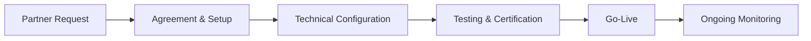

# Trading Partners

## Overview

EDI trading partners are the external organizations — suppliers, carriers, 3PLs — that exchange electronic business documents with Meijer. Each partner must be set up, tested, and certified before production EDI transactions can flow.

## Trading Partner Onboarding Process

### Step 1: Partner Request
- New trading partner request submitted by buyer (suppliers) or transportation team (carriers)
- Request includes: partner name, required transaction sets, expected volume, timeline

### Step 2: Agreement & Setup
- Trading partner agreement executed (communication protocol, transaction sets, responsibilities)
- Partner registered in EDI system with unique identifier
- ISA/GS qualifiers assigned or confirmed

### Step 3: Technical Configuration

| Configuration Item | Description |
|---|---|
| **ISA Qualifier & ID** | Partner's interchange identifier (ISA05/ISA06 for sender, ISA07/ISA08 for receiver) |
| **GS Identifier** | Application sender/receiver codes |
| **Communication Protocol** | VAN, AS2, or SFTP — configured and tested |
| **Transaction Set Mapping** | Data mapping between Meijer and partner formats |
| **Envelope Settings** | ISA control numbers, segment terminators, delimiters |

### Step 4: Testing & Certification
1. **Syntax testing** — Verify transaction structure is valid X12
2. **Content testing** — Verify data elements contain correct values
3. **Round-trip testing** — Send PO (850) → receive acknowledgment (855) → receive ASN (856) → send 997
4. **Edge case testing** — Test partial shipments, rejections, changes
5. **Volume testing** — Confirm system handles expected daily volume
6. **Certification sign-off** — Both parties confirm testing passed

### Step 5: Go-Live
- Partner enabled for production transactions
- Initial transactions monitored closely for errors
- Support contact information exchanged

### Step 6: Ongoing Monitoring
- Transaction success/failure rates tracked
- 997 acknowledgment compliance monitored
- Regular partner reviews for high-volume partners

## ISA/GS Qualifier and ID Management

### ISA Qualifiers

| Qualifier | Meaning | Used For |
|---|---|---|
| **01** | DUNS number | Large suppliers with DUNS |
| **08** | UCC/EAN company code | GS1 company prefix |
| **12** | Phone number | Legacy partners |
| **14** | DUNS + suffix | Multi-location DUNS |
| **ZZ** | Mutually defined | Partners without standard qualifier |

### Meijer's ISA/GS Identifiers
- Meijer's ISA ID and qualifier are provided during partner onboarding
- Partners must use their assigned ISA/GS identifiers in all transactions
- Control numbers must increment sequentially and never repeat

## Communication Protocols

### VAN (Value-Added Network)

| Attribute | Detail |
|---|---|
| **Description** | Third-party network that routes EDI between trading partners |
| **Advantages** | Handles connectivity to many partners; error checking; archival |
| **Disadvantages** | Per-transaction fees; slight latency |
| **Used For** | Most suppliers and carriers; default protocol |

### AS2 (Applicability Statement 2)

| Attribute | Detail |
|---|---|
| **Description** | Direct point-to-point encrypted HTTP connection |
| **Advantages** | No per-transaction fees; real-time; highly secure |
| **Disadvantages** | Requires direct setup per partner; certificate management |
| **Used For** | High-volume partners where VAN costs are significant |
| **Security** | SSL/TLS encryption + digital signatures + MDN receipts |

### SFTP (Secure File Transfer Protocol)

| Attribute | Detail |
|---|---|
| **Description** | File-based transfer over encrypted SSH connection |
| **Advantages** | Simple; good for batch files; widely supported |
| **Disadvantages** | Not real-time; requires polling for new files |
| **Used For** | Partners who cannot support VAN or AS2; batch data exchanges |

## Partner-Specific Requirements

Different partner types have different EDI requirements:

### Suppliers (Required Transactions)
| Transaction | Direction | Required? |
|---|---|---|
| 850 - Purchase Order | Outbound | Receive from Meijer |
| 855 - PO Acknowledgment | Inbound | Must send to Meijer |
| 856 - ASN | Inbound | Must send to Meijer |
| 810 - Invoice | Inbound | Must send to Meijer |
| 860 - PO Change | Outbound | Receive from Meijer |
| 997 - Functional Ack | Both | Required |

### Carriers (Required Transactions)
| Transaction | Direction | Required? |
|---|---|---|
| 204 - Load Tender | Outbound | Receive from Meijer |
| 990 - Tender Response | Inbound | Must send to Meijer |
| 214 - Shipment Status | Inbound | Must send to Meijer |
| 210 - Freight Invoice | Inbound | Must send to Meijer |
| 997 - Functional Ack | Both | Required |

## Troubleshooting Partner Issues

| Issue | Common Cause | Resolution |
|---|---|---|
| Transactions not received by partner | VAN routing error; wrong ISA ID | Verify VAN mailbox; confirm ISA/GS identifiers |
| 997 rejected with errors | Mapping issue; missing required segment | Review 997 error details; fix mapping; retransmit |
| Duplicate transactions | Control number reuse; system retry | Reset control numbers; deduplicate on receiver side |
| Partner changed ISA/GS without notice | Partner system migration | Update partner configuration; retest |
| AS2 certificate expired | Certificate not renewed before expiry | Exchange new certificates; update AS2 configuration |
| Transactions delayed | VAN processing backlog; SFTP polling interval | Check VAN status; reduce SFTP polling interval |
