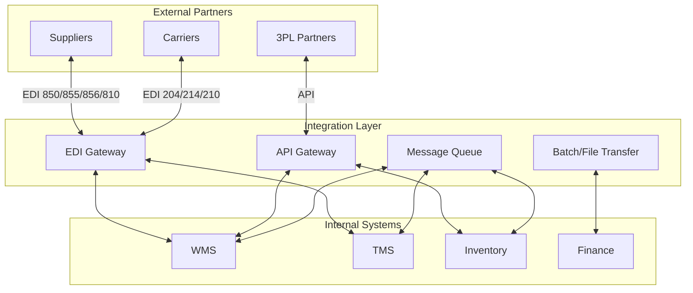

# Integrations Overview

## Overview

Meijer's supply chain systems communicate through multiple integration patterns. This section documents EDI, APIs, and data flows between systems.

## Integration Architecture

## Integration Methods

| Method | Use Case | Partners |
|---|---|---|
| **EDI** | Structured business documents | Suppliers, carriers |
| **REST APIs** | Real-time data exchange | Internal systems, 3PLs |
| **Message Queues** | Event-driven, async processing | Internal systems |
| **Batch/SFTP** | Large data sets, reports | Finance, analytics |

## Key Docs

- [EDI Overview](/docs/systems/integrations/edi/overview)
- [EDI Transaction Sets](/docs/systems/integrations/edi/transaction-sets)
- [Trading Partners](/docs/systems/integrations/edi/trading-partners)
- [APIs](/docs/systems/integrations/apis)
- [Data Flows](/docs/systems/integrations/data-flows)
