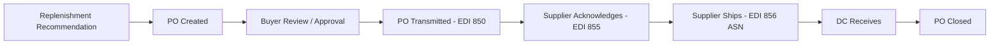

# Ordering

## Overview

The ordering system manages the purchase order lifecycle — from automated PO generation through supplier acknowledgment, modification, and tracking. It transforms replenishment engine recommendations into executable supplier orders and ensures orders are transmitted, confirmed, and monitored.

## PO Lifecycle

## PO Generation

### Automated Generation
The majority of purchase orders are auto-generated by the replenishment engine:

1. **Replenishment run** — Engine calculates order needs across all items/locations
2. **Order consolidation** — Individual item needs grouped into POs by vendor
3. **Minimum order check** — PO verified against vendor minimum order requirements (dollars, cases, pallets)
4. **Delivery date calculation** — Requested delivery date based on lead time + buffer
5. **PO created** — Order record created with line items, quantities, costs, and delivery details

### Manual PO Creation
Manual POs are created for:
- New item initial orders
- Emergency replenishment
- Seasonal pre-builds outside normal cycle
- Special orders (store requests, event inventory)
- Forward buy opportunities (temporary vendor cost reductions)

## Approval Workflow

| PO Type | Auto-Approved? | Approval Required |
|---|---|---|
| **Auto-generated, within parameters** | Yes | None |
| **Auto-generated, exceeding threshold** | No | Buyer approval |
| **Manual PO** | No | Buyer + category manager (above $ threshold) |
| **Emergency PO** | No | Buyer (expedited review) |
| **Forward buy** | No | Category manager + director |

Thresholds are configurable by category and vendor.

## PO Transmission (EDI 850)

Purchase orders are sent to suppliers electronically via EDI 850:

### Key PO Data Elements

| Field | Description |
|---|---|
| **PO Number** | Unique Meijer PO identifier |
| **Vendor Number** | Meijer's supplier ID |
| **Order Date** | Date PO was created |
| **Requested Delivery Date** | When product is needed at DC |
| **Ship-To Location** | Destination DC code and address |
| **Line Items** | Item number (UPC/GTIN), description, ordered quantity, unit cost |
| **Terms** | Payment terms, FOB, freight terms |
| **Special Instructions** | Pallet configuration, labeling requirements, appointment notes |

## Order Acknowledgment (EDI 855)

Suppliers confirm receipt and acceptance of POs:

| Response Type | Meaning | System Action |
|---|---|---|
| **Accepted** | Supplier will fill order as requested | PO status → Confirmed |
| **Accepted with changes** | Supplier modified quantities or dates | PO updated; buyer alerted for review |
| **Rejected** | Supplier cannot fill the order | PO status → Rejected; buyer notified; re-source needed |
| **No response** | Supplier did not acknowledge within SLA | Alert generated; buyer follows up manually |

## Order Modification (EDI 860)

PO changes after initial transmission:

| Change Type | Process |
|---|---|
| **Quantity increase** | EDI 860 sent with updated line quantities |
| **Quantity decrease** | EDI 860 sent; vendor confirms |
| **Cancel line item** | EDI 860 with line cancellation |
| **Cancel entire PO** | EDI 860 cancellation; vendor confirms |
| **Date change** | EDI 860 with updated delivery date |

Changes are tracked in the order history for audit purposes.

## Order Tracking and Visibility

| Status | Description |
|---|---|
| **Draft** | PO created but not yet transmitted |
| **Submitted** | PO sent to vendor via EDI |
| **Acknowledged** | Vendor confirmed receipt (EDI 855) |
| **Shipped** | Vendor shipped; ASN received (EDI 856) |
| **Partially Received** | Some lines received; others outstanding |
| **Received** | All lines received and verified |
| **Closed** | PO completed; invoicing finalized |
| **Cancelled** | PO cancelled before fulfillment |

### Buyer Dashboard
Buyers have visibility into:
- Open PO summary by vendor and category
- Past-due POs (requested delivery date exceeded)
- Acknowledgment status (unconfirmed POs highlighted)
- Shipment tracking (ASN received vs. expected)
- Vendor fill rate trends

## Three-Way Match

Before invoices are paid, a three-way match verifies:

1. **Purchase Order** — What was ordered (items, quantities, prices)
2. **Receipt** — What was received at the DC (items, quantities from WMS receipt)
3. **Invoice (EDI 810)** — What the vendor is billing

| Match Result | Action |
|---|---|
| All three match | Auto-approve for payment |
| PO ↔ Receipt mismatch | Receiving exception investigation |
| Receipt ↔ Invoice mismatch | Invoice dispute; short-pay or hold |
| Price mismatch | Cost discrepancy resolution with vendor |
