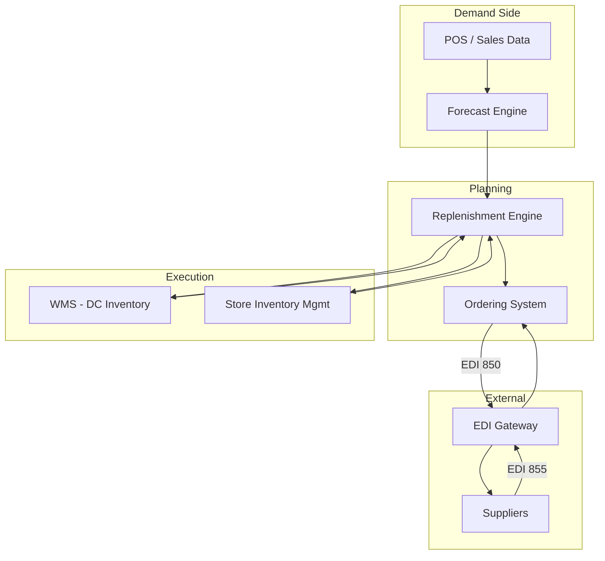

# Inventory Systems Overview

## Purpose

Meijer's inventory systems manage the end-to-end flow of inventory data — from demand forecasting and replenishment calculations through purchase order generation and store inventory tracking. These systems ensure the right products are available at the right locations at the right time.

## System Components

## Key Modules

### Forecast Engine
Generates demand forecasts using historical sales data, promotional calendars, seasonal patterns, and causal factors. Feeds the replenishment engine with projected demand at the store-SKU level.

### Replenishment Engine
Calculates order quantities by comparing projected demand against current inventory positions, safety stock targets, and lead times. Generates both DC-to-store transfer orders and supplier purchase orders. See [Replenishment Engine](/docs/systems/inventory-systems/replenishment-engine).

### Ordering System
Manages the purchase order lifecycle from generation through supplier acknowledgment. Handles PO creation, approval workflows, EDI transmission, and order tracking. See [Ordering](/docs/systems/inventory-systems/ordering).

### Store Inventory Management
Tracks perpetual inventory at the store level. Processes POS transactions, receiving, adjustments, and transfers. Supports cycle counting and shrink tracking.

### DC Inventory (WMS)
Warehouse inventory is managed by the WMS but feeds data to the inventory systems for replenishment calculations. See [WMS Overview](/docs/systems/wms/overview).

## Data Sources and Inputs

| Data Source | Frequency | Used For |
|---|---|---|
| **POS Sales Data** | Near real-time | Demand signal, on-hand updates |
| **Store Inventory Snapshots** | Daily | Replenishment calculations |
| **DC Inventory Positions** | Real-time (from WMS) | DC availability for store orders |
| **Supplier Lead Times** | Updated as needed | Safety stock and order timing |
| **Promotional Calendar** | Updated 4-8 weeks ahead | Demand uplift forecasting |
| **Item Master Data** | Updated as changed | Pack sizes, costs, case dimensions |
| **Vendor Cost Files** | Per contract cycle | PO cost calculations |

## Integration Architecture

| System | Direction | Data | Method |
|---|---|---|---|
| **POS Systems** | Inbound | Sales transactions, returns | Near real-time feed |
| **WMS** | Bidirectional | Inventory positions, receipts, transfer orders | API |
| **EDI Gateway** | Outbound | Purchase Orders (850), PO Changes (860) | EDI |
| **EDI Gateway** | Inbound | PO Acknowledgments (855), ASNs (856), Invoices (810) | EDI |
| **Store Systems** | Bidirectional | Inventory adjustments, cycle counts, receiving | API/Batch |
| **Finance** | Outbound | Inventory valuation, cost data | Batch |
| **BI / Analytics** | Outbound | Inventory metrics, forecast accuracy | Batch/API |

## Environments

| Environment | Purpose |
|---|---|
| **Production** | Live inventory calculations and order generation |
| **UAT** | Testing new parameters, algorithm changes, and promotions |
| **QA** | Automated regression testing |
| **Dev** | Development and prototyping |

## Related Docs

- [Replenishment Engine](/docs/systems/inventory-systems/replenishment-engine)
- [Ordering](/docs/systems/inventory-systems/ordering)
- [Troubleshooting](/docs/systems/inventory-systems/troubleshooting)
