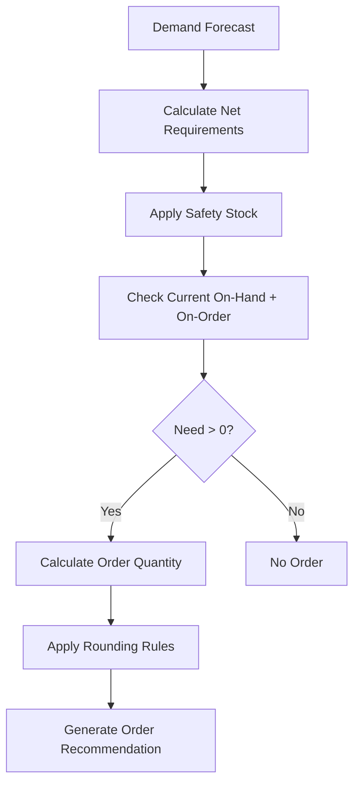

# Replenishment Engine

## Overview

The replenishment engine is the core calculation system that determines what to order, how much to order, and when to order. It runs daily (and intraday for critical categories) to generate store transfer orders and DC purchase order recommendations.

## Algorithm Logic



### Core Calculation

The basic replenishment formula:

```
Order Quantity = (Forecast Demand × Days of Coverage) + Safety Stock - On-Hand - On-Order
```

Where:
- **Forecast Demand** — Projected daily demand from the forecast engine
- **Days of Coverage** — Number of days the order should cover (based on order cycle)
- **Safety Stock** — Buffer to protect against demand and supply variability
- **On-Hand** — Current physical inventory
- **On-Order** — Inventory in transit or on open POs not yet received

## Parameter Configuration

### Safety Stock

Safety stock is calculated based on demand variability and desired service level:

| Input | Description |
|---|---|
| **Demand Variability** | Standard deviation of daily sales over recent history |
| **Lead Time Variability** | Variation in supplier/DC delivery times |
| **Service Level Target** | Desired probability of not stocking out (e.g., 97.5%) |
| **Z-Score** | Statistical multiplier based on service level |

```
Safety Stock = Z × √(Lead Time × σ²demand + Demand² × σ²lead_time)
```

### Lead Times

| Component | Description | Source |
|---|---|---|
| **Supplier Lead Time** | Days from PO to DC receipt | Vendor master / historical |
| **DC Processing Time** | Days from receipt to available for store shipment | WMS metrics |
| **Transit Time** | Days from DC ship to store receipt | TMS route data |
| **Review Period** | Days between replenishment calculations | System configuration |

### Order Quantities

| Parameter | Description |
|---|---|
| **Minimum Order Qty** | Smallest quantity that can be ordered (case pack, inner pack) |
| **Order Multiple** | Orders rounded up to case pack or pallet quantity |
| **Maximum Order Qty** | Cap to prevent over-ordering (shelf capacity, budget) |
| **Economic Order Qty (EOQ)** | Optimal order size balancing order cost vs. carrying cost |

## Trigger Types

| Trigger | Logic | Best For |
|---|---|---|
| **Reorder Point (ROP)** | Order when on-hand drops below ROP | Stable-demand items with consistent lead times |
| **Min/Max** | Order up to Max when on-hand drops below Min | Items where target inventory range is defined |
| **Time-Based (Periodic)** | Review and order on fixed schedule regardless of position | Categories with fixed delivery schedules |
| **Forecast-Driven** | Order quantity calculated from projected demand | All items (primary method) |
| **Rate of Sale** | Smoothed recent sales velocity drives order quantity | Fast-moving consumables |

## Promotional and Seasonal Overrides

### Promotional Overrides
- **Pre-build** — Additional inventory ordered before promotion start date
- **Lift factor** — Forecast multiplied by expected promotional lift (e.g., 2.5x)
- **Post-promo adjustment** — Forecast reduced after promotion to avoid overstock
- **Display quantity** — Extra inventory for endcap and display builds

### Seasonal Overrides
- **Seasonal profiles** — Calendar-based demand curves applied to seasonal items
- **Ramp-up** — Gradual inventory build starting weeks before season
- **Ramp-down** — Order reduction as season ends; clearance trigger if overstock
- **Season end date** — Hard cutoff for new orders; remaining stock marked down

## Exception Handling

| Exception | System Behavior | Human Action |
|---|---|---|
| **Calculated order > max** | Capped at maximum; alert generated | Planner reviews — increase max or split orders |
| **Calculated order < minimum** | Rounded up to minimum order quantity | None (automatic) |
| **No forecast available** | Fall back to recent sales average | Planner creates manual forecast or override |
| **Negative inventory position** | Order based on forecast only (ignoring negative) | Investigate inventory accuracy; cycle count |
| **Supplier capacity constraint** | Order reduced to supplier's stated capacity | Seek alternate supplier or delay |
| **New item (no history)** | Use like-item forecast or manual setting | Planner sets initial parameters |

## Performance Monitoring

| Metric | Description | Target |
|---|---|---|
| **In-Stock Rate** | % of active SKUs with inventory available at store | ≥97% |
| **Fill Rate** | % of store orders filled complete by DC | ≥98% |
| **Forecast Accuracy (MAPE)** | Mean Absolute Percentage Error of demand forecast | <20% |
| **Excess Inventory** | SKUs with >X weeks of supply on hand | Minimize |
| **Order Cycle Time** | Time from replenishment run to product on shelf | Category-dependent |
| **Service Level** | Probability of not stocking out during lead time | ≥97.5% |

## Tuning

- **Parameter refresh** — Safety stock and lead times recalculated monthly based on latest data
- **Forecast model selection** — Best-fit model selected per item based on error metrics
- **Seasonal transition** — Profiles updated annually based on prior year actuals
- **Exception review** — Daily review of overrides, alerts, and abnormal orders by planners
