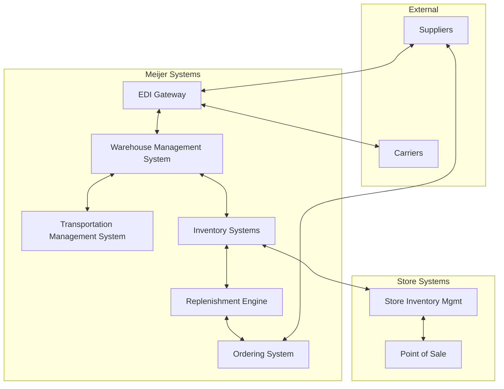

# Systems Overview

This section documents the software systems that power Meijer's supply chain. Each system is covered with architecture details, configuration guides, workflows, and troubleshooting.

## System Landscape

## Systems at a Glance

| System | Purpose | Key Docs |
|---|---|---|
| **WMS** | Warehouse operations — receiving, putaway, picking, shipping | [Overview](/docs/systems/wms/overview) |
| **TMS** | Transportation planning, routing, carrier management | [Overview](/docs/systems/tms/overview) |
| **Inventory Systems** | Replenishment, ordering, demand forecasting | [Overview](/docs/systems/inventory-systems/overview) |
| **Integrations & EDI** | System-to-system communication, EDI transactions, APIs | [Overview](/docs/systems/integrations/overview) |

## Integration Architecture

All systems communicate through a combination of:
- **EDI** — Standard transaction sets (850, 856, 810, etc.) for supplier/carrier communication
- **APIs** — REST/SOAP services for internal system integration
- **Batch Files** — Scheduled data transfers for reporting and bulk operations
- **Message Queues** — Real-time event-driven communication between systems

See [Integration Overview](/docs/systems/integrations/overview) for detailed data flow diagrams.

## Known Technology Stack

Based on publicly available information (job postings, vendor case studies, third-party profiles):

| Category | Technology |
|---|---|
| **ERP** | SAP |
| **E-Commerce** | SAP Hybris (meijer.com); CommerceHub for drop-ship |
| **POS** | NCR Corporation hardware; Verifone/Ingenico payment terminals |
| **POS Management** | OpenText ZENworks — remote zero-touch deployment, bi-weekly automated updates |
| **DC Automation** | WITRON OPM (dry grocery); Dematic (micro-fulfillment) |
| **Cloud** | Microsoft Azure; Google Cloud |
| **CRM** | Salesforce |
| **Digital Marketing** | Adobe |
| **CDN / Security** | Akamai (CDN and bot management) |
| **IT Monitoring** | SolarWinds |
| **Networking** | Cisco Systems |
| **Analytics** | IBM; Power BI |
| **Development** | C#, .NET Core, Microsoft Blazor, Kotlin, MySQL |
| **In-Store Tech** | Shop & Scan mobile checkout |
| **Mobile** | Native iOS and Android apps |

:::note
Some technology attributions come from third-party profilers and have not been independently confirmed by Meijer. Internal system specifics may differ.
:::

## Environments

| Environment | Purpose |
|---|---|
| **Production** | Live systems |
| **UAT** | User acceptance testing |
| **QA** | Quality assurance and regression testing |
| **Dev** | Development and feature work |
