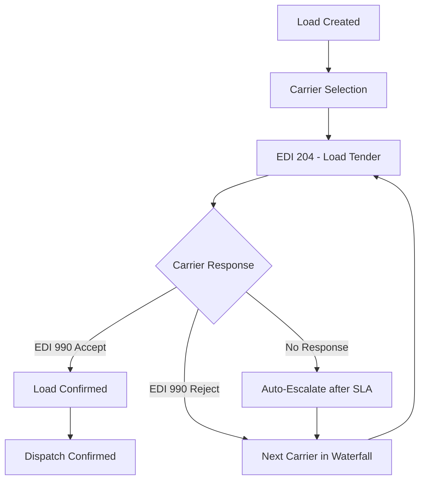

# Carrier Integration

## Overview

Carrier integration connects the TMS with external transportation providers for load tendering, shipment tracking, and freight settlement. Integration methods include EDI, APIs, and carrier portals depending on the carrier's capabilities.

## Connectivity Methods

| Method | Description | Typical Carriers |
|---|---|---|
| **EDI (VAN)** | Traditional EDI via Value-Added Network | Large national/regional carriers |
| **EDI (AS2)** | Direct point-to-point encrypted EDI | High-volume partners |
| **API (REST)** | Real-time web services for tendering and tracking | Tech-forward carriers, 3PLs |
| **Carrier Portal** | Web-based interface for smaller carriers | Local and specialty carriers |
| **Load Boards** | Posted for spot market coverage | Spot/overflow carriers |

## Load Tendering Workflow

### Tender Process
1. **Load ready** — TMS creates load with origin, destination(s), pickup time, equipment type
2. **Carrier selected** — Routing guide assigns primary carrier based on lane, rate, and performance
3. **Tender sent** — EDI 204 transmitted to carrier with load details
4. **Response window** — Carrier has defined time (typically 30-60 minutes) to respond
5. **Accept** — Carrier confirms with EDI 990; load moves to dispatch
6. **Reject/No response** — Load cascades to next carrier in waterfall; eventually posted to spot market

### EDI 204 — Load Tender Key Data

| Field | Description |
|---|---|
| Shipment ID | Meijer's unique load identifier |
| Equipment Type | Dry van, reefer, flatbed, etc. |
| Origin | DC address and dock assignment |
| Destination(s) | Store address(es) and stop sequence |
| Pickup Date/Time | Required pickup window |
| Delivery Date/Time | Required delivery window per stop |
| Weight | Total shipment weight |
| Pieces/Pallets | Pallet count and piece count |
| Special Instructions | Temperature settings, driver-assist, appointment notes |

## Shipment Tracking

### EDI 214 — Shipment Status
Carriers send status updates at key milestones:

| Status Code | Description | When Sent |
|---|---|---|
| **AF** | Carrier has picked up shipment | At origin departure |
| **X3** | Arrived at stop | At each delivery stop |
| **D1** | Delivered | At final destination |
| **OA** | Out for delivery | En route to next stop |
| **CP** | Completed | All stops delivered |
| **SE** | Delay/exception | When shipment delayed |

### GPS / Telematics Tracking
- Private fleet vehicles tracked via onboard telematics (continuous)
- Third-party carriers tracked via ELD/GPS integrations where available
- Geofencing at DCs and stores triggers automatic arrival/departure events
- Real-time ETA calculations based on current position and route

### Tracking Visibility
- **Dispatch** — Real-time map view of all in-transit loads
- **Store operations** — ETA notifications for incoming deliveries
- **Customer service** — Delivery status for e-commerce order inquiries
- **Automated alerts** — Late shipment warnings when ETA exceeds delivery window

## Proof of Delivery (POD)

| POD Method | Description |
|---|---|
| **Electronic signature** | Driver captures store receiver signature on mobile device |
| **Scan confirmation** | Store scans pallet labels upon delivery |
| **Photo capture** | Driver photographs delivered freight at store |
| **EDI 214 D1 status** | Electronic confirmation of delivery |
| **Paper BOL signature** | Fallback — signed paper Bill of Lading |

## Freight Audit and Payment

### Invoice Processing
1. **Carrier submits invoice** — EDI 210 (Freight Invoice) or paper/PDF invoice
2. **Auto-matching** — TMS matches invoice to load, carrier, and contracted rate
3. **Variance check** — System flags discrepancies beyond tolerance (e.g., >$25 or >2%)
4. **Exception review** — Freight analyst reviews flagged invoices
5. **Approval** — Clean or resolved invoices approved for payment
6. **Payment** — AP processes payment per carrier payment terms

### Common Audit Discrepancies

| Issue | Cause | Resolution |
|---|---|---|
| Rate mismatch | Wrong rate applied by carrier | Correct to contract rate; notify carrier |
| Accessorial not approved | Detention/driver-assist not pre-authorized | Verify with dispatch; approve or reject |
| Duplicate invoice | Carrier submitted same load twice | Reject duplicate |
| Weight discrepancy | Carrier weight vs. WMS weight | Use WMS weight as primary; investigate if large |

## Carrier Onboarding (Technical)

Steps to enable a new carrier for electronic integration:

1. **Trading partner agreement** — ISA/GS qualifiers, communication protocol decided
2. **EDI testing** — Exchange test transactions for each required set (204, 990, 214, 210)
3. **Mapping validation** — Verify data mapping between Meijer and carrier formats
4. **Connectivity setup** — VAN enrollment, AS2 certificates, or API credentials
5. **Go-live** — Enable production transactions; monitor initial loads
6. **Support documentation** — Carrier receives integration guide and support contacts
