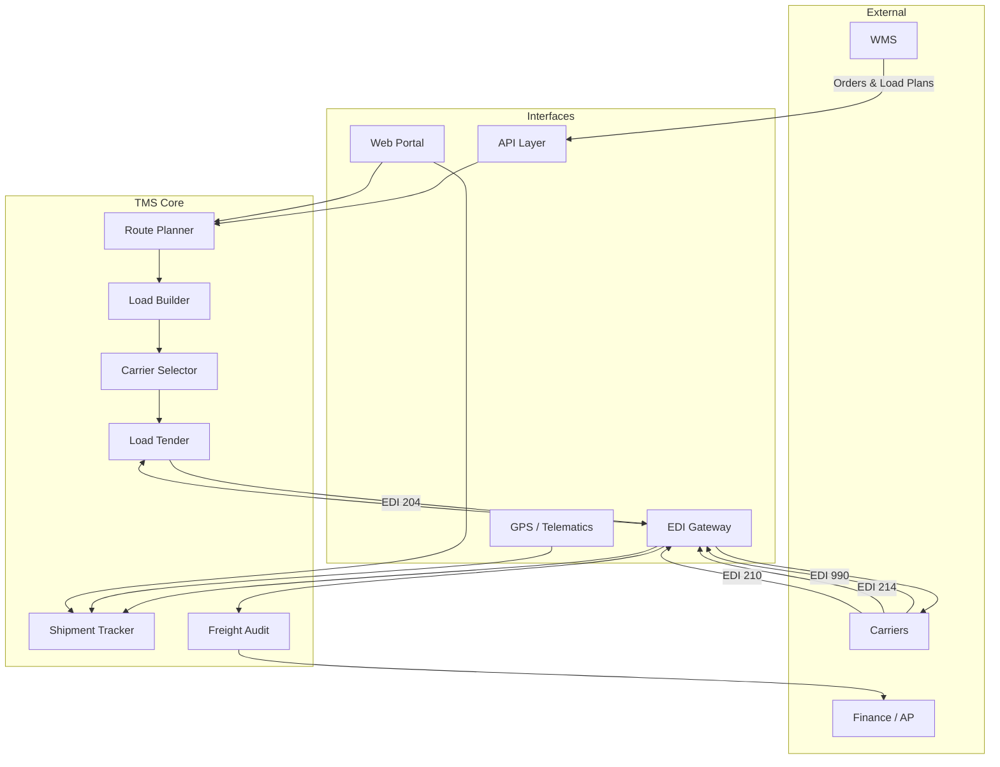

# TMS Overview

## Purpose

The Transportation Management System (TMS) plans, optimizes, and manages the movement of freight from Meijer's distribution centers to stores and from suppliers to DCs. It handles routing, load planning, carrier selection, load tendering, shipment tracking, and freight payment.

## Scope

| Function | TMS Role |
|---|---|
| **Route Planning** | Build optimized delivery routes from DCs to stores |
| **Load Building** | Assign orders to trailers; optimize cube and weight |
| **Carrier Selection** | Match loads to carriers (private fleet or 3PL) |
| **Load Tendering** | Electronically tender loads to carriers via EDI/API |
| **Shipment Tracking** | Monitor in-transit shipments via GPS and EDI 214 |
| **Freight Audit** | Validate carrier invoices against contracted rates |
| **Freight Payment** | Process approved invoices for payment |
| **Performance Analytics** | Track carrier KPIs, cost per mile, on-time metrics |

## Architecture

## Key Modules

### Route Planner
Builds optimized multi-stop routes considering delivery windows, driver hours, vehicle capacity, and geographic constraints. Supports both static (recurring) and dynamic (daily optimized) routing. See [Routing Engine](/docs/systems/tms/routing-engine).

### Load Builder
Groups store orders onto trailers to maximize utilization. Considers weight limits, cube capacity, temperature zones, and stop sequence (reverse load order for multi-stop routes).

### Carrier Selector
Matches loads to the best available carrier based on: lane coverage, contracted rates, capacity, performance history, and equipment type. Private fleet prioritized before tendering to third-party carriers.

### Load Tender
Electronically sends load requests to carriers via EDI 204 (Motor Carrier Load Tender). Manages tender waterfall (primary → backup → spot market). Tracks responses via EDI 990. See [Carrier Integration](/docs/systems/tms/carrier-integration).

### Shipment Tracker
Provides real-time visibility into shipment location and status. Sources data from GPS/telematics (fleet) and EDI 214 (carriers). Generates alerts for late shipments and ETA updates for stores.

### Freight Audit
Validates carrier invoices (EDI 210) against contracted rates, accessorial agreements, and actual shipment data. Flags discrepancies for review before payment.

## User Roles

| Role | Responsibilities |
|---|---|
| **Dispatcher** | Daily route management, load tendering, exception handling |
| **Route Planner** | Route optimization, delivery window management, master route maintenance |
| **Carrier Manager** | Carrier onboarding, contract management, performance reviews |
| **Freight Analyst** | Rate analysis, cost reporting, freight audit review |
| **Administrator** | System configuration, user management, integration setup |

## Integration Points

| System | Integration | Method |
|---|---|---|
| **WMS** | Outbound orders, load status, trailer assignments | API (real-time) |
| **EDI Gateway** | Carrier communication (204, 990, 214, 210) | EDI/AS2/SFTP |
| **GPS/Telematics** | Fleet vehicle tracking | API (real-time) |
| **Finance/AP** | Freight invoices and payment authorization | Batch file |
| **Carrier Portals** | Small carrier load board and tracking | Web services |

## Related Docs

- [Routing Engine](/docs/systems/tms/routing-engine)
- [Carrier Integration](/docs/systems/tms/carrier-integration)
- [Troubleshooting](/docs/systems/tms/troubleshooting)
