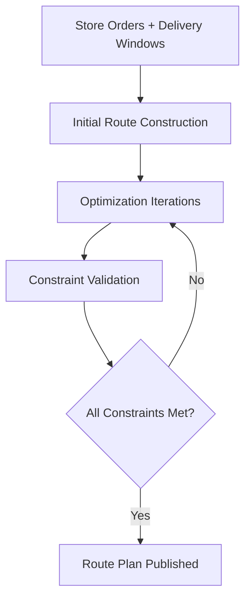

# Routing Engine

## Overview

The TMS routing engine builds optimized delivery routes from distribution centers to stores. It balances multiple competing constraints — delivery windows, driver hours, vehicle capacity, fuel costs, and road conditions — to produce efficient, executable route plans.

## Routing Algorithm

The routing engine uses a constraint-based optimization approach:

### Optimization Steps
1. **Seed routes** — Assign each store to a route based on geography and DC assignment
2. **Cluster stops** — Group nearby stores that share delivery windows
3. **Sequence stops** — Order stops to minimize total drive time
4. **Balance loads** — Distribute volume across routes to maximize trailer utilization
5. **Check constraints** — Validate all hard constraints (HOS, weight, windows)
6. **Iterate** — Swap and rearrange stops to find lower-cost solutions
7. **Finalize** — Publish route plan for execution

## Constraint Configuration

### Hard Constraints
These cannot be violated — routes that break hard constraints are rejected:

| Constraint | Limit | Source |
|---|---|---|
| **Delivery Window** | Store-specific time range | Store master data |
| **Driver HOS** | 11 hrs driving / 14 hrs on-duty | FMCSA regulations |
| **Gross Vehicle Weight** | 80,000 lbs | DOT regulations |
| **Trailer Cube Capacity** | ~2,800 cubic ft (53' trailer) | Equipment specs |
| **Bridge/Road Restrictions** | Height, weight, hazmat limits | Road network data |

### Soft Constraints
These are optimized but can be relaxed if necessary:

| Constraint | Preference | Weight |
|---|---|---|
| **Minimize total miles** | Shorter routes preferred | High |
| **Maximize trailer utilization** | Fuller trailers preferred | High |
| **Minimize number of routes** | Fewer routes = fewer trucks | Medium |
| **Driver familiarity** | Assign drivers to known routes | Low |
| **Balance delivery times** | Spread store arrivals evenly | Low |

## Static vs. Dynamic Routing

| Mode | Description | Use Case |
|---|---|---|
| **Static (Template) Routes** | Fixed routes that run on a recurring schedule (same stores, same days, same sequence) | High-volume, predictable lanes |
| **Dynamic Routes** | Routes optimized daily based on actual order volume and constraints | Variable demand, seasonal shifts |
| **Hybrid** | Template routes used as starting point, then adjusted dynamically | Most common approach |

### Template Route Management
- Templates define: DC origin, store stops, stop sequence, day-of-week schedule
- Templates reviewed and updated quarterly or when network changes occur
- Optimizer can modify template routes when order volume requires adjustment

## Multi-Stop Optimization

Most DC-to-store routes serve multiple stores per trip:

| Factor | Consideration |
|---|---|
| **Stop count** | Typically 2-5 stores per route; more stops = more complexity |
| **Dwell time** | Average time per store stop (unload time) factored into total route time |
| **Loading sequence** | Pallets loaded in reverse delivery order (last stop first, first stop last) |
| **Product mixing** | Multi-temp loads require reefer with zone separation |
| **Store proximity** | Closer stores grouped together to minimize inter-stop drive time |

## Route Execution

Once routes are published:

1. **Load building** — TMS passes route plan to load builder for trailer assignment
2. **Driver assignment** — Dispatchers assign drivers based on availability and qualifications
3. **Departure scheduling** — Route departure time calculated from delivery window constraints
4. **Execution tracking** — GPS tracking monitors actual vs. planned route
5. **Exception management** — Late departures, route deviations, or missed windows flagged

## Performance Metrics

| Metric | Description | Target |
|---|---|---|
| **Route Optimization Score** | Actual vs. theoretical optimal route cost | ≥90% of optimal |
| **Stop Density** | Average stops per route | 2-5 |
| **Avg Miles Per Stop** | Total route miles ÷ number of stops | Minimize |
| **Planned vs. Actual Miles** | Route adherence to planned path | \<5% deviation |
| **Solver Runtime** | Time for optimizer to build daily route plan | \<30 minutes |
| **Window Compliance** | % of routes meeting all delivery windows | ≥95% |

## Tuning and Maintenance

- **Quarterly route reviews** — Compare planned vs. actual performance; adjust templates
- **Seasonal adjustments** — Modify routes for holiday volume, road construction, weather
- **New store integration** — Add new stores to existing routes or create new routes
- **Store closure/remodel** — Temporarily or permanently remove stores from routes
- **Constraint updates** — Update delivery windows, road restrictions, and equipment specs as needed
