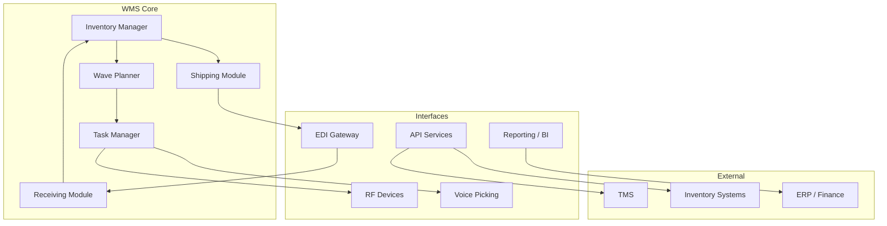

# WMS Overview

## Purpose

The Warehouse Management System (WMS) is the central system that manages all distribution center operations — from receiving inbound shipments to shipping outbound orders to stores. It directs warehouse workers, optimizes storage and picking, maintains inventory accuracy, and provides real-time visibility into DC performance.

## Scope

The WMS manages the following processes across all Meijer distribution centers:

| Process | WMS Role |
|---|---|
| **Receiving** | Dock door assignment, ASN validation, receipt confirmation |
| **Putaway** | Directed putaway, slotting, location assignment |
| **Inventory Management** | Location tracking, cycle counting, adjustments, holds |
| **Replenishment** | Pick face replenishment from reserve locations |
| **Wave Planning** | Order grouping, wave release, task prioritization |
| **Picking** | Directed picking (voice, RF, pick-to-light), task assignment |
| **Packing** | Pallet building rules, stretch wrap, labeling |
| **Shipping** | Load planning, trailer assignment, BOL generation |
| **Yard Management** | Trailer tracking, dock scheduling, yard moves |
| **Returns** | Inbound returns processing, disposition |

## Architecture

## Key Modules

### Inventory Manager
Maintains real-time inventory positions by item, lot, location, and license plate (LPN). Tracks inventory status (available, allocated, held, damaged) and enforces FIFO/FEFO rules.

### Wave Planner
Groups store orders into waves based on delivery schedule, route, and DC capacity. Releases waves to the Task Manager for execution. Supports wave-based and waveless picking modes.

### Task Manager
Creates and prioritizes individual work tasks (pick, putaway, replenishment, count) and assigns them to operators based on zone, equipment, and priority. Manages task interleaving for maximum efficiency.

### Receiving Module
Processes inbound shipments: dock door management, ASN matching, receipt confirmation, and quality holds. Generates putaway tasks upon receipt completion.

### Shipping Module
Manages outbound operations: load building, dock door assignment, trailer loading verification, BOL generation, and departure confirmation.

## User Roles

| Role | Access Level | Typical User |
|---|---|---|
| **Operator** | Execute tasks (pick, putaway, receive, ship) | Warehouse associates |
| **Lead / Supervisor** | Monitor operations, reassign tasks, handle exceptions | Shift leads |
| **Planner** | Wave planning, workload balancing, slotting changes | Operations planners |
| **Administrator** | System configuration, user management, master data | IT / WMS admins |
| **Read-Only** | Dashboards, reports, inventory inquiries | Management, analysts |

## Integration Points

| System | Direction | Data Exchanged |
|---|---|---|
| **EDI Gateway** | Inbound | ASN (856), PO data (850) |
| **EDI Gateway** | Outbound | Ship confirmations, BOL data |
| **TMS** | Bidirectional | Load plans, route assignments, trailer status |
| **Inventory Systems** | Outbound | Inventory snapshots, receipt confirmations |
| **Replenishment Engine** | Inbound | Store orders, transfer orders |
| **ERP / Finance** | Outbound | Inventory valuation, receipt accruals |
| **Reporting / BI** | Outbound | Operational metrics, productivity data |

## Environments

| Environment | Purpose | Refresh Cycle |
|---|---|---|
| **Production** | Live warehouse operations | N/A |
| **UAT** | User acceptance testing for new features and changes | Refreshed from production quarterly |
| **QA** | Automated and manual testing | Refreshed monthly |
| **Dev** | Development and prototyping | On-demand |
| **Training** | New employee onboarding and process training | Refreshed before training sessions |

## Related Docs

- [Configuration](/docs/systems/wms/configuration)
- [Workflows](/docs/systems/wms/workflows)
- [Troubleshooting](/docs/systems/wms/troubleshooting)
