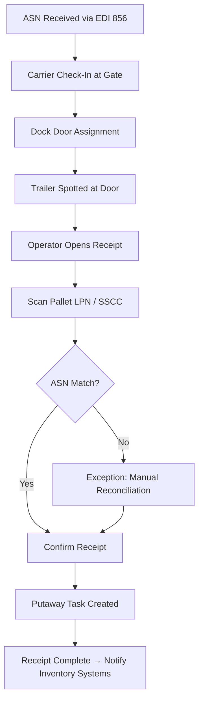
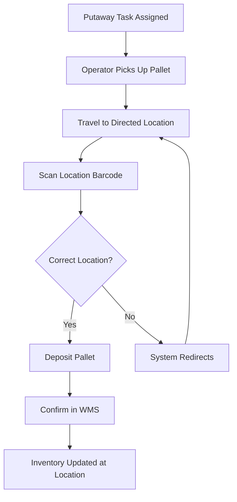
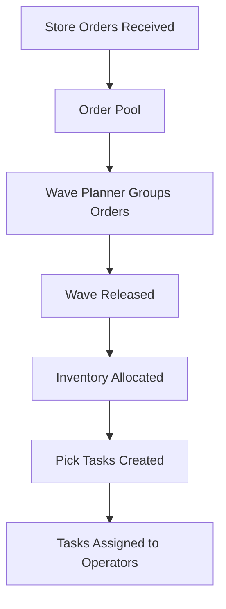
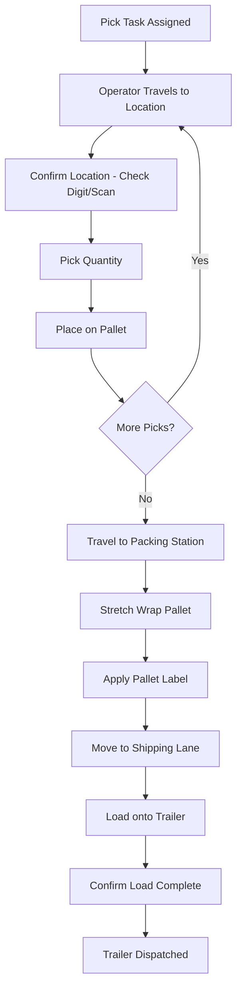
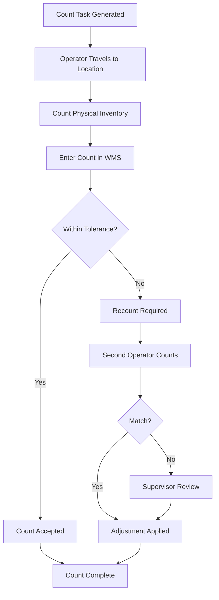
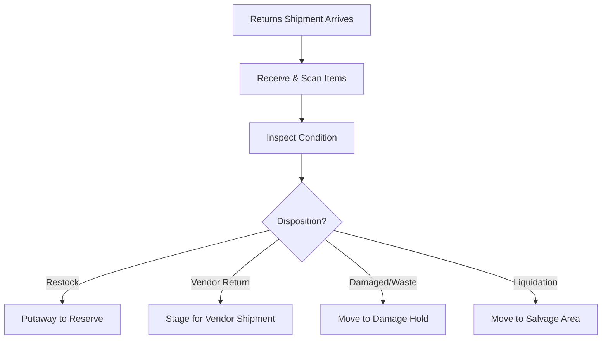

# WMS Workflows

## Overview

This document describes the key business workflows managed by the WMS, from inbound receiving through outbound shipping. Each workflow includes the system steps, operator interactions, and integration touchpoints.

## Inbound Receiving Workflow

### Key Steps
1. **ASN pre-receipt** — EDI 856 creates expected receipt in WMS before carrier arrival
2. **Check-in** — Guard/gate confirms carrier, assigns appointment
3. **Door assignment** — WMS or yard management assigns dock door based on product type
4. **Pallet scanning** — Operator scans GS1-128 / SSCC barcode on each pallet
5. **Validation** — System matches scanned data against ASN (item, quantity, lot, expiration)
6. **Exceptions** — Mismatches flagged; operator or supervisor resolves (accept, reject, adjust)
7. **Completion** — Receipt closed; inventory available; putaway tasks generated

## Putaway Workflow

### Putaway Logic
- WMS evaluates item attributes (size, weight, velocity, temperature) against available locations
- Priority: pick face replenishment > zone-directed > closest available
- Operator confirms deposit by scanning location barcode
- System updates inventory position in real-time

## Wave Planning and Order Allocation

### Wave Planning Process
1. **Order import** — Store replenishment orders received from inventory systems
2. **Wave grouping** — Orders grouped by route, departure time, and temperature zone
3. **Allocation** — System reserves (allocates) inventory for the wave from available stock
4. **Task creation** — Individual pick tasks generated per item/location
5. **Task release** — Tasks made available to operators in priority order
6. **Monitoring** — Planner monitors wave progress; manages exceptions (short picks, re-allocations)

### Wave Grouping Criteria
| Criterion | Description |
|---|---|
| Route / Carrier | All stores on a route grouped together |
| Departure cutoff | Wave must complete before trailer departure time |
| Temperature zone | Separate waves for ambient, refrigerated, frozen |
| Product type | GM and grocery may wave separately |
| Priority | Rush orders or promotional builds wave first |

## Pick / Pack / Ship Workflow

### Picking
- Voice-directed or RF-directed depending on zone and pick type
- Operator confirms each pick with check digit (voice) or barcode scan (RF)
- Short picks reported immediately; system re-allocates if alternate inventory exists
- Pallet building rules enforced (heavy on bottom, crushable on top, weight limits)

### Packing
- Completed pallets moved to wrap station
- Stretch wrapped for transit stability
- Pallet label applied with: store number, route, stop sequence, pallet ID, weight
- Quality audit performed on random pallets

### Shipping
- Pallets staged in outbound lanes by route/stop
- Trailer loaded in reverse stop sequence
- Each pallet scanned during loading to confirm correct trailer
- Bill of Lading (BOL) generated upon load completion
- Trailer sealed; seal number recorded in WMS

## Cycle Count Workflow

### Count Triggers
- Scheduled ABC counts (A-items counted more frequently)
- Negative on-hand detection
- Pick location empty unexpectedly
- Receipt discrepancy follow-up
- Annual physical inventory support

## Returns Processing Workflow

## Exception Handling

| Exception | WMS Behavior | Resolution |
|---|---|---|
| **Short pick** | Alert operator; check alternate locations | Re-allocate or short-ship |
| **Location mismatch** | Block transaction; require supervisor override | Investigate and correct data |
| **Inventory hold** | Prevent allocation of held inventory | Quality team releases or disposes |
| **System timeout** | Queue transaction for retry | Automatic retry; manual intervention if persistent |
| **Equipment failure** | Operator reports via exception screen | Reassign to alternate device; maintenance dispatch |
